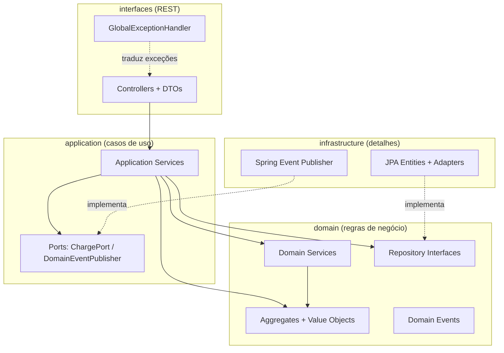
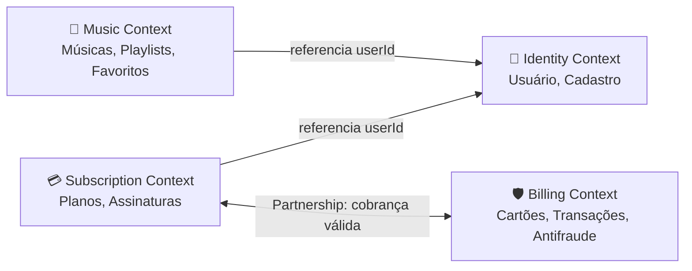
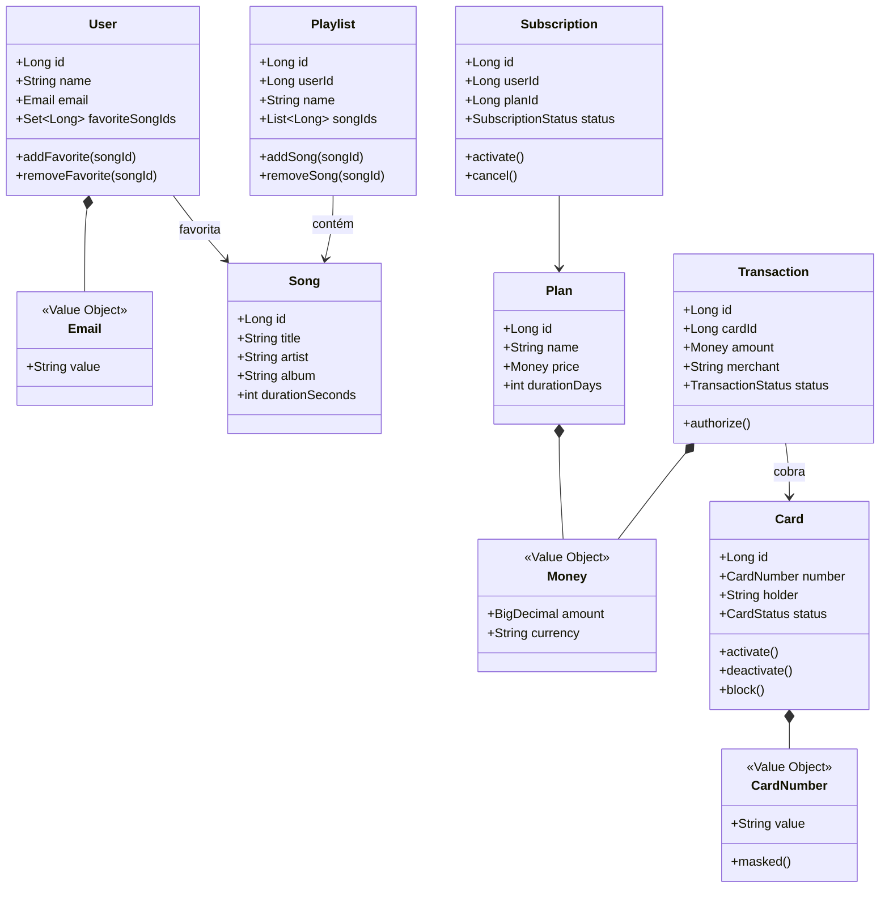
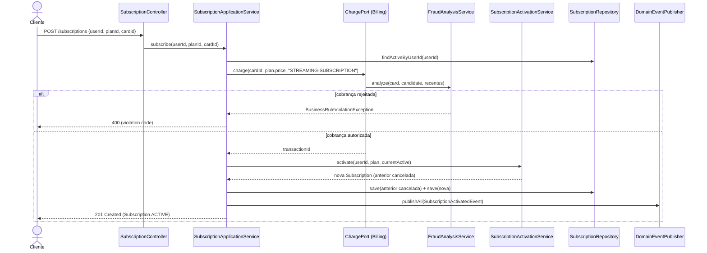
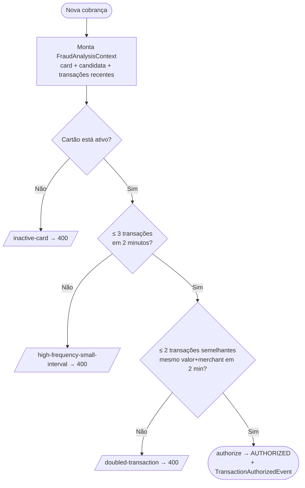

# 🎵 Streaming Platform

> Plataforma de streaming de música (estilo Spotify) construída com **Java 21**, **Spring Boot 3**, **Domain-Driven Design**, **Clean Architecture** e **SOLID**.

[](https://openjdk.org/projects/jdk/21/)
[](https://spring.io/projects/spring-boot)
[](https://maven.apache.org/)
[](#16-testes)

---

## 📑 Sumário

1. [Visão Geral](#1-visão-geral)
2. [Objetivos](#2-objetivos)
3. [Tecnologias Utilizadas](#3-tecnologias-utilizadas)
4. [Arquitetura](#4-arquitetura)
5. [Bounded Contexts](#5-bounded-contexts)
6. [Estrutura de Pastas](#6-estrutura-de-pastas)
7. [Modelo de Domínio](#7-modelo-de-domínio)
8. [Fluxo de Assinatura](#8-fluxo-de-assinatura)
9. [Fluxo Antifraude](#9-fluxo-antifraude)
10. [Endpoints](#10-endpoints)
11. [Exemplos de Requisição](#11-exemplos-de-requisição)
12. [Exemplos de Resposta](#12-exemplos-de-resposta)
13. [Regras de Negócio](#13-regras-de-negócio)
14. [Estratégia DDD](#14-estratégia-ddd)
15. [Estratégia SOLID](#15-estratégia-solid)
16. [Testes](#16-testes)
17. [Banco H2](#17-banco-h2)
18. [Swagger](#18-swagger)
19. [Melhorias Futuras](#19-melhorias-futuras)

---

## 1. Visão Geral

A **Streaming Platform** é uma API REST que simula o núcleo de um serviço de streaming de música. O sistema permite que usuários se cadastrem, assinem planos pagos, montem playlists, favoritem músicas e tenham suas cobranças processadas por um **motor antifraude** extensível.

A modelagem segue **Domain-Driven Design** (estratégico e tático), a organização do código respeita a **Clean Architecture** (domínio isolado de frameworks) e cada classe foi desenhada à luz dos princípios **SOLID** e de **Clean Code**.

O domínio cobre seis capacidades centrais: criação de contas, assinatura de planos, gerenciamento de playlists, favoritar músicas, processamento de transações financeiras e análise antifraude.

---

## 2. Objetivos

- Demonstrar uma separação rigorosa entre **domínio**, **aplicação**, **infraestrutura** e **interfaces**.
- Modelar **Aggregates**, **Value Objects**, **Domain Services** e **Domain Events** de forma idiomática.
- Aplicar **Context Mapping** real (relação *Partnership* entre Subscription e Billing).
- Construir um motor antifraude **aberto para extensão e fechado para modificação** (OCP).
- Garantir que o domínio **não dependa de Spring nem de JPA** (inversão de dependência).
- Entregar uma suíte de testes (unitários + integração) com cobertura mínima de **80%**.
- Disponibilizar documentação interativa via **OpenAPI/Swagger** e console **H2**.

---

## 3. Tecnologias Utilizadas

| Categoria | Tecnologia | Versão | Papel no projeto |
|-----------|------------|--------|------------------|
| Linguagem | Java | 21 | Records, *pattern matching*, *sealed* etc. |
| Framework | Spring Boot | 3.3.5 | Núcleo da aplicação e injeção de dependências |
| Web | Spring Web MVC | 6.x | Controllers REST |
| Persistência | Spring Data JPA / Hibernate | 6.x | Repositórios e mapeamento objeto-relacional |
| Banco | H2 Database | runtime | Banco em memória para desenvolvimento/testes |
| Validação | Bean Validation (Jakarta) | 3.x | Validação declarativa de DTOs |
| Boilerplate | Lombok | — | *Getters/setters* apenas nas entidades JPA |
| Documentação | springdoc-openapi | 2.6.0 | Geração de OpenAPI 3 + Swagger UI |
| Testes | JUnit 5 | 5.x | Framework de testes |
| Mocks | Mockito | 5.x | Isolamento de dependências em testes unitários |
| Asserções | AssertJ | 3.x | Asserções fluentes |
| Cobertura | JaCoCo | 0.8.12 | Relatório e verificação de cobertura (≥80%) |
| Build | Maven | 3.9+ | Gerenciamento de dependências e ciclo de vida |

---

## 4. Arquitetura

O projeto combina três pilares: **Clean Architecture**, **DDD** e **SOLID**.

### 4.1 Clean Architecture

A regra de ouro é a **regra da dependência**: o código-fonte aponta sempre para dentro, em direção ao domínio. Camadas externas conhecem as internas, nunca o contrário.



- **domain** — coração do sistema. Contém *Aggregates*, *Value Objects*, *Domain Services*, *Domain Events* e as **interfaces** de repositório. **Zero anotações de framework.**
- **application** — orquestra casos de uso, controla transações e define *ports* (abstrações de saída).
- **infrastructure** — implementa os repositórios com JPA, faz o *mapping* entre domínio e tabelas e publica eventos.
- **interfaces** — expõe a API REST, converte DTOs e centraliza o tratamento de erros.
- **config / shared** — *beans* de configuração e blocos reutilizáveis (ex.: `Money`, `AggregateRoot`).

### 4.2 Modelo de Persistência Separado

O domínio **não é anotado com JPA**. Para cada *Aggregate* existe um par `XJpaEntity` (anotado) + `XMapper` + `XRepositoryAdapter`. Isso mantém o domínio puro e testável, ao custo de um *mapping* explícito — uma troca consciente em favor do isolamento.

---

## 5. Bounded Contexts

O sistema é dividido em quatro *Bounded Contexts*. A relação **Subscription ↔ Billing** é uma **Partnership**: uma assinatura só é ativada se a cobrança correspondente for autorizada.



| Context | Responsabilidade | Aggregate Root |
|---------|------------------|----------------|
| **Identity** | Usuário, cadastro, dados básicos, favoritos | `User` |
| **Subscription** | Planos e ciclo de vida de assinaturas | `Subscription` |
| **Music** | Catálogo de músicas e playlists | `Playlist` |
| **Billing** | Cartões, transações e antifraude | `Transaction` |

> A relação *Partnership* é materializada por uma porta (`ChargePort`) **definida no contexto Subscription** e **implementada no contexto Billing** (`SubscriptionChargeAdapter`). Assim, Subscription depende de uma abstração e nunca de detalhes do Billing — evitando dependência circular e respeitando o DIP.

---

## 6. Estrutura de Pastas

```text
streaming-platform
├── pom.xml
├── README.md
└── src
    ├── main
    │   ├── java/com/streaming
    │   │   ├── StreamingApplication.java
    │   │   │
    │   │   ├── config
    │   │   │   ├── DomainServicesConfig.java     # wiring de domain services (sem Spring no domínio)
    │   │   │   └── OpenApiConfig.java
    │   │   │
    │   │   ├── shared                            # Kernel compartilhado
    │   │   │   ├── domain        (AggregateRoot, DomainEvent, Money)
    │   │   │   ├── application   (DomainEventPublisher)
    │   │   │   └── exception     (BusinessRuleViolationException, ResourceNotFoundException)
    │   │   │
    │   │   ├── domain                            # REGRAS DE NEGÓCIO PURAS
    │   │   │   ├── identity      (User, Email, UserRepository)
    │   │   │   ├── subscription  (Subscription, Plan, SubscriptionActivationService, ...)
    │   │   │   ├── music         (Playlist, Song, repositórios)
    │   │   │   └── billing       (Card, Transaction, FraudRule + regras, FraudAnalysisService)
    │   │   │
    │   │   ├── application                       # CASOS DE USO
    │   │   │   ├── identity      (UserApplicationService)
    │   │   │   ├── subscription  (SubscriptionApplicationService, ChargePort)
    │   │   │   ├── music         (SongApplicationService, PlaylistApplicationService)
    │   │   │   └── billing       (CardApplicationService, TransactionApplicationService, SubscriptionChargeAdapter)
    │   │   │
    │   │   ├── infrastructure                    # DETALHES TÉCNICOS
    │   │   │   ├── identity / subscription / music / billing
    │   │   │   │       (XJpaEntity, XJpaRepository, XMapper, XRepositoryAdapter)
    │   │   │   └── shared        (SpringDomainEventPublisher, DomainEventLogger)
    │   │   │
    │   │   └── interfaces                        # ADAPTADORES DE ENTRADA (REST)
    │   │       ├── identity / subscription / music / billing
    │   │       │       (XController, CreateXRequest, XResponse)
    │   │       └── shared        (GlobalExceptionHandler, ApiError)
    │   │
    │   └── resources
    │       ├── application.yml
    │       └── data.sql                          # dados iniciais (seed)
    │
    └── test/java/com/streaming
        ├── shared/domain        (MoneyTest)
        ├── domain
        │   ├── identity         (EmailTest, UserTest)
        │   ├── music            (PlaylistTest)
        │   ├── billing          (CardTest, CardNumberTest, FraudRulesTest, FraudAnalysisServiceTest)
        │   └── subscription     (SubscriptionActivationServiceTest)
        ├── application
        │   ├── billing          (TransactionApplicationServiceTest)
        │   └── subscription     (SubscriptionApplicationServiceTest)
        └── interfaces           (UserControllerIT, TransactionControllerIT, CatalogAndSubscriptionIT)
```

---

## 7. Modelo de Domínio



Legenda: `*--` indica composição (Value Object pertencente ao Aggregate); `-->` indica referência por identidade (`Long`), respeitando a regra DDD de **referenciar outros Aggregates apenas por id**.

---

## 8. Fluxo de Assinatura

A ativação de um plano depende de uma cobrança autorizada. O diagrama abaixo mostra a colaboração entre as camadas e a *Partnership* com o Billing.



---

## 9. Fluxo Antifraude

O motor executa cada regra registrada em sequência. A **primeira** regra não satisfeita aborta a análise com o código de violação correspondente. Adicionar uma nova regra significa implementar `FraudRule` e registrá-la — **nenhum código existente é alterado** (OCP).



| Regra | Classe | Limite | Violação |
|-------|--------|--------|----------|
| 1 | `InactiveCardRule` | cartão deve estar `ACTIVE` | `inactive-card` |
| 2 | `HighFrequencySmallIntervalRule` | máx. 3 transações / 2 min | `high-frequency-small-interval` |
| 3 | `DoubledTransactionRule` | máx. 2 semelhantes / 2 min | `doubled-transaction` |

---

## 10. Endpoints

| Método | Rota | Descrição | Sucesso |
|--------|------|-----------|---------|
| `POST` | `/users` | Cria um usuário | 201 |
| `GET` | `/users/{id}` | Busca usuário por id | 200 |
| `GET` | `/users` | Lista usuários | 200 |
| `POST` | `/users/{id}/favorites/{songId}` | Favorita uma música | 200 |
| `DELETE` | `/users/{id}/favorites/{songId}` | Remove favorito | 200 |
| `POST` | `/cards` | Registra um cartão | 201 |
| `PATCH` | `/cards/{id}/activate` | Ativa um cartão | 200 |
| `PATCH` | `/cards/{id}/deactivate` | Desativa um cartão | 200 |
| `POST` | `/subscriptions` | Assina um plano (com cobrança) | 201 |
| `GET` | `/subscriptions/{id}` | Busca assinatura por id | 200 |
| `POST` | `/songs` | Cadastra uma música | 201 |
| `GET` | `/songs` | Lista músicas | 200 |
| `POST` | `/playlists` | Cria uma playlist | 201 |
| `POST` | `/playlists/{id}/songs/{songId}` | Adiciona música à playlist | 200 |
| `DELETE` | `/playlists/{id}/songs/{songId}` | Remove música da playlist | 200 |
| `GET` | `/playlists/{id}` | Busca playlist por id | 200 |
| `POST` | `/transactions` | Processa uma cobrança (antifraude) | 201 |
| `GET` | `/transactions/{id}` | Busca transação por id | 200 |

---

## 11. Exemplos de Requisição

**Criar usuário**
```http
POST /users
Content-Type: application/json

{ "name": "Carol Dias", "email": "carol@stream.io" }
```

**Registrar cartão**
```http
POST /cards
Content-Type: application/json

{ "number": "4111111111111111", "holder": "Carol Dias", "expiration": "10/2031", "cvv": "321" }
```

**Assinar um plano**
```http
POST /subscriptions
Content-Type: application/json

{ "userId": 2, "planId": 3, "cardId": 1 }
```

**Cadastrar música**
```http
POST /songs
Content-Type: application/json

{ "title": "Yesterday", "artist": "The Beatles", "album": "Help!", "durationSeconds": 125 }
```

**Criar playlist e adicionar música**
```http
POST /playlists
Content-Type: application/json

{ "userId": 1, "name": "Foco Total" }
```
```http
POST /playlists/100/songs/3
```

**Processar transação**
```http
POST /transactions
Content-Type: application/json

{ "cardId": 1, "amount": 19.90, "currency": "BRL", "merchant": "STREAMING" }
```

---

## 12. Exemplos de Resposta

**Sucesso — `201 Created` (assinatura)**
```json
{
  "id": 100,
  "userId": 2,
  "planId": 3,
  "status": "ACTIVE",
  "startDate": "2025-06-22",
  "endDate": "2025-07-22"
}
```

**Sucesso — `201 Created` (transação)**
```json
{
  "id": 100,
  "cardId": 1,
  "amount": 19.90,
  "currency": "BRL",
  "merchant": "STREAMING",
  "dateTime": "2025-06-22T13:45:10.123",
  "status": "AUTHORIZED"
}
```

**Erro — `400 Bad Request` (violação de regra de negócio)**
```json
{
  "timestamp": "2025-06-22T13:45:10.987",
  "status": 400,
  "error": "Business Rule Violation",
  "message": "inactive-card",
  "path": "/transactions"
}
```

**Erro — `404 Not Found`**
```json
{
  "timestamp": "2025-06-22T13:45:11.020",
  "status": 404,
  "error": "Resource Not Found",
  "message": "Card not found with id: 999",
  "path": "/transactions"
}
```

**Erro — `400 Bad Request` (validação de payload)**
```json
{
  "timestamp": "2025-06-22T13:45:11.050",
  "status": 400,
  "error": "Validation Error",
  "message": "email: email must be valid",
  "path": "/users"
}
```

---

## 13. Regras de Negócio

| # | Regra | Onde é aplicada | Violação |
|---|-------|-----------------|----------|
| 1 | Um usuário só pode ter **um plano ativo** por vez; ao assinar, o anterior é cancelado | `SubscriptionActivationService` | — |
| 2 | Reassinar o **mesmo plano já ativo** é proibido | `SubscriptionActivationService` | `active-subscription-already-exists` |
| 3 | Uma assinatura exige uma **cobrança autorizada** | `SubscriptionApplicationService` + `ChargePort` | (propaga violação do antifraude) |
| 4 | Não cobrar **cartão inativo** | `InactiveCardRule` | `inactive-card` |
| 5 | Não permitir **mais de 3 transações em 2 minutos** | `HighFrequencySmallIntervalRule` | `high-frequency-small-interval` |
| 6 | Não permitir **mais de 2 transações semelhantes** (mesmo valor + merchant) em 2 minutos | `DoubledTransactionRule` | `doubled-transaction` |
| 7 | E-mail de usuário é **único** | `UserApplicationService` | `email-already-registered` |
| 8 | Playlist **não contém músicas duplicadas** | `Playlist` (Aggregate) | — |
| 9 | `Email`, `CardNumber` e `Money` validam-se na **criação** (sempre válidos) | Value Objects | `IllegalArgumentException` |

---

## 14. Estratégia DDD

### Aggregate Roots
`User`, `Subscription`, `Playlist` e `Transaction`. Cada raiz protege seus invariantes e é a **única porta de entrada** para alterar o estado do agregado. Referências a outros agregados são feitas **por identidade** (`Long`), nunca por objeto, evitando agregados gigantes.

### Entities
`Plan` e `Song` são entidades com identidade própria, referenciadas pelos agregados de Subscription e Music.

### Value Objects
`Email`, `Money` e `CardNumber` são **imutáveis**, validam-se na construção e comparam-se por valor. `Money` normaliza escala (2 casas, `HALF_EVEN`) e moeda; `CardNumber` expõe versão mascarada; `Email` normaliza para minúsculas.

### Domain Services
- `FraudAnalysisService` — coordena as regras antifraude (lógica que não pertence a um único agregado).
- `SubscriptionActivationService` — encapsula a regra "apenas um plano ativo".

### Repositories
Interfaces declaradas **no domínio** (`UserRepository`, `SubscriptionRepository`, `PlaylistRepository`, `TransactionRepository`, etc.) e implementadas na infraestrutura por *adapters* JPA. O domínio desconhece o Hibernate.

### Domain Events
`SubscriptionActivatedEvent` e `TransactionAuthorizedEvent` são registrados pelos agregados e publicados pela aplicação após a persistência, demonstrando o conceito sem acoplar mensageria.

### Context Mapping
**Partnership** entre Subscription e Billing, implementada via porta `ChargePort` (definida em Subscription, implementada em Billing) — colaboração explícita e sem dependência circular.

---

## 15. Estratégia SOLID

| Princípio | Como é aplicado |
|-----------|-----------------|
| **SRP** — Responsabilidade Única | Cada classe tem um motivo para mudar: controllers só convertem HTTP↔DTO, *application services* orquestram, agregados guardam invariantes, mappers traduzem persistência. |
| **OCP** — Aberto/Fechado | O motor antifraude aceita novas `FraudRule` sem alterar `FraudAnalysisService`; basta criar a regra e registrá-la em `DomainServicesConfig`. |
| **LSP** — Substituição de Liskov | Toda implementação de `FraudRule`, `ChargePort`, `DomainEventPublisher` e dos repositórios é intercambiável; o cliente programa contra a abstração. |
| **ISP** — Segregação de Interfaces | Interfaces pequenas e focadas (`ChargePort` com um único método; repositórios expõem só o necessário a cada agregado). |
| **DIP** — Inversão de Dependência | *Application services* e domínio dependem de abstrações; as implementações concretas (JPA, Spring Events) vivem na infraestrutura e são injetadas. |

---

## 16. Testes

A suíte cobre **Value Objects**, **Aggregates**, **Domain Services**, **regras antifraude** (unitários com JUnit 5/AssertJ/Mockito) e **Controllers** (integração com `MockMvc` e `@SpringBootTest`, validando o fluxo completo, inclusive cenários de fraude).

```bash
# Executar todos os testes
mvn test

# Executar testes + relatório de cobertura JaCoCo
mvn verify

# O relatório HTML é gerado em:
target/site/jacoco/index.html
```

A verificação de cobertura (JaCoCo) exige **no mínimo 80% de linhas** cobertas, ligada à fase `verify`. Entidades JPA, DTOs e classes de configuração são excluídas da métrica por serem código estrutural.

Cenários de destaque:
- `FraudRulesTest` / `FraudAnalysisServiceTest` — cada regra isolada e a composição.
- `SubscriptionActivationServiceTest` — cancelamento do plano anterior e bloqueio de reassinatura.
- `TransactionControllerIT` — `inactive-card`, `doubled-transaction` e `high-frequency-small-interval` ponta a ponta.
- `CatalogAndSubscriptionIT` — catálogo, playlists, cartões e assinatura com cobrança real.

---

## 17. Banco H2

O banco é **em memória** e populado por `data.sql` na inicialização.

| Parâmetro | Valor |
|-----------|-------|
| Console | http://localhost:8080/h2-console |
| JDBC URL | `jdbc:h2:mem:streaming` |
| Usuário | `sa` |
| Senha | *(vazia)* |

> Dados iniciais incluem 2 usuários (Alice, Bruno), 3 planos (Free/Premium/Family), 2 cartões (um `ACTIVE`, um `INACTIVE`), 5 músicas, 1 playlist e 1 assinatura ativa.

---

## 18. Swagger

A documentação interativa é gerada automaticamente pelo springdoc-openapi.

| Recurso | URL |
|---------|-----|
| Swagger UI | http://localhost:8080/swagger-ui.html |
| OpenAPI JSON | http://localhost:8080/v3/api-docs |

---

## 19. Melhorias Futuras

- **Autenticação e autorização** (Spring Security + JWT) e associação de cartões ao seu titular.
- **Persistência relacional real** (PostgreSQL) com *migrations* via Flyway/Liquibase.
- **Idempotência** em `POST /transactions` e `POST /subscriptions`.
- **Publicação de eventos** para um broker (Kafka/RabbitMQ) em vez de listeners locais.
- **Renovação automática** de assinaturas e cobrança recorrente agendada.
- **Paginação e filtros** nos endpoints de listagem.
- **Regras antifraude adicionais** (geolocalização, *velocity* por dispositivo) — triviais graças ao OCP.
- **Observabilidade**: métricas (Micrometer), *tracing* e *health checks* (Actuator).

---

## ▶️ Como Executar

```bash
# Pré-requisitos: JDK 21 e Maven 3.9+

# 1. Compilar e rodar os testes
mvn clean verify

# 2. Subir a aplicação
mvn spring-boot:run

# 3. Acessar
#    Swagger .... http://localhost:8080/swagger-ui.html
#    H2 ......... http://localhost:8080/h2-console
```

---

<div align="center">
Desenvolvido com · DDD · Clean Architecture · SOLID
</div>
