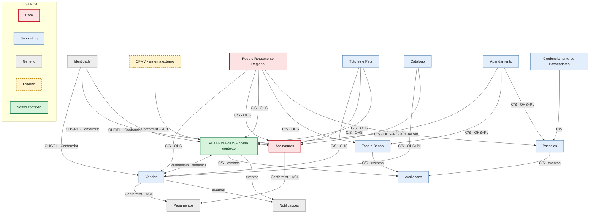

# Modelagem Estratégica com DDD — Pet Friends
### Trabalho de Domain-Driven Design — Equipe responsável pelo contexto *Gestão de Veterinários*

> **Observação sobre o método.** Escrevi este trabalho tentando mostrar o *caminho do raciocínio*, e não só as respostas finais. Sempre que tomei uma decisão importante, deixei registrado também a alternativa que descartei e o porquê. Em DDD, quase nunca existe "a resposta certa" — existe a decisão melhor justificada para o contexto. Como estou começando a aprender, prefiro errar mostrando o raciocínio a acertar por sorte.

---

## ETAPA 1 — Análise do Negócio

Antes de falar em Bounded Context, subdomínio ou qualquer termo técnico, preciso entender *o que a Pet Friends realmente é*. Lendo o enunciado e olhando o organograma da imagem, cheguei à seguinte interpretação.

### 1.1 O que a Pet Friends é (na minha leitura)

A Pet Friends **não é uma loja**. É uma **rede de franquias** que conecta três mundos diferentes:

1. **Tutores** (os clientes finais, donos dos pets);
2. **Lojas franqueadas** (1041 unidades, cada uma "dona" de uma região);
3. **Fornecedores e profissionais** (distribuidores credenciados, veterinários, passeadores).

O detalhe que mudou minha forma de enxergar o negócio foi este: *cada loja cuida de uma região definida por uma lista de CEPs, sem sobreposição*. Isso significa que a Pet Friends é, na essência, uma **plataforma nacional que roteia tudo para uma loja local**. Eu pesquiso um produto no site nacional, mas quem entrega, agenda e atende é a loja do meu CEP. Esse "roteamento por CEP" não é um detalhe técnico: é a regra que organiza praticamente todos os fluxos. Voltarei nele várias vezes.

### 1.2 Objetivos da empresa (o que ela quer alcançar)

| # | Objetivo | Como eu percebi isso no enunciado |
|---|----------|-----------------------------------|
| O1 | Vender produtos pet em escala nacional com logística local | E-commerce + entrega pela loja da região |
| O2 | Criar **receita recorrente** (o grande diferencial) | Assinatura de ração e pacotes mensais de serviço |
| O3 | Ser um **hub de serviços** para o pet, não só de produtos | Veterinário, banho/tosa, passeio agendáveis |
| O4 | Garantir **confiança e conformidade** nos serviços | Validação de veterinário no CFMV, avaliação de passeadores |
| O5 | Padronizar a marca mantendo operação franqueada | Matriz define catálogo; loca opera a região |

Reparei que O2 e O3 são os que mais "diferenciam" a Pet Friends de um pet shop comum. O enunciado inclusive diz explicitamente que a assinatura é "um diferencial dessa linha de negócio". Guardei isso para a etapa de classificação dos subdomínios.

### 1.3 Fluxos principais

Identifiquei seis fluxos centrais. Vou descrevê-los como o tutor os vive, porque DDD pede que a gente pense na linguagem de quem usa o sistema.

**Fluxo A — Compra avulsa de produto**
Tutor pesquisa → adiciona ao carrinho → paga → o sistema descobre *qual loja atende o CEP dele* → essa loja entrega ou libera retirada.

**Fluxo B — Assinatura de ração/produtos**
Tutor monta um pacote sob medida para o pet (gato, cachorro, peixe ou pássaro) → escolhe periodicidade → o sistema gera entregas recorrentes (cada uma vira, na prática, um pedido roteado para a loja da região).

**Fluxo C — Consulta veterinária** *(o nosso contexto)*
Tutor abre a agenda → escolhe um veterinário específico **ou** pede "o primeiro disponível" → marca o horário → comparece → o veterinário atende → pode emitir uma **receita**, que se conecta com a venda de remédios.

**Fluxo D — Banho/Tosa**
A unidade cadastra *slots* de tempo → tutor escolhe um slot → pode ser avulso ou pacote mensal.

**Fluxo E — Passeio**
O passeador cadastra disponibilidade → tutor marca → avulso ou pacote mensal. O passeador precisa antes ter sido **credenciado** naquela região.

**Fluxo F — Credenciamento de profissionais**
Veterinário: cadastro validado junto ao CFMV. Passeador: cadastro com tipo de animal, avaliação, horários, dados profissionais, vinculado à região da loja.

### 1.4 Regras de negócio que consegui extrair

Listei as regras que aparecem (explícitas) e algumas que *infiro* com hipótese própria (marquei como **[H]** — hipótese minha, plausível, que assumo para fechar o modelo).

| Código | Regra | Origem |
|--------|-------|--------|
| R1 | Cada CEP pertence a exatamente uma loja; não há sobreposição de regiões | Explícita |
| R2 | O catálogo de produtos é definido pela matriz, não pela loja | Explícita |
| R3 | Produtos têm categoria: higiene, diversão, farmácia | Explícita |
| R4 | A entrega/retirada é sempre feita pela loja da região do CEP do cliente | Explícita |
| R5 | Remédios ("farmácia") podem exigir interação com o módulo de veterinários | Explícita |
| R6 | Assinatura é por pet e por espécie (gato, cachorro, peixe, pássaro) | Explícita |
| R7 | Veterinário só pode atender se tiver registro válido no CFMV | Explícita |
| R8 | Tutor pode escolher veterinário específico OU o primeiro disponível | Explícita |
| R9 | Cada veterinário tem disponibilidade própria cadastrada | Explícita |
| R10 | Passeador atende por região e tem avaliação dos clientes | Explícita |
| R11 **[H]** | Uma consulta só pode ocupar um slot livre do veterinário; dois tutores não podem reservar o mesmo slot | Hipótese |
| R12 **[H]** | Remédio de uso controlado só é vendido se houver uma receita veterinária válida e dentro da validade | Hipótese |
| R13 **[H]** | Se o CRMV do veterinário expirar/for suspenso, sua agenda é bloqueada automaticamente para novas marcações | Hipótese |
| R14 **[H]** | O pacote mensal de serviço gera os agendamentos, mas a cobrança é recorrente e independente de cada comparecimento | Hipótese |

As hipóteses R11–R14 são minhas, mas escolhi todas tentando ser fiel ao espírito do negócio (segurança jurídica, evitar overbooking, conformidade).

### 1.5 Dependências entre áreas (visão ainda informal)

Antes de desenhar contextos, mapeei "quem precisa de quem" em linguagem de negócio:

- **Quase tudo depende de "qual loja atende este CEP"** → existe um conhecimento central de *roteamento regional*.
- **Vendas, Assinatura e Veterinário (remédios) dependem do Catálogo** → o catálogo é uma fonte de verdade compartilhada.
- **Veterinário, Banho/Tosa e Passeio dependem de uma ideia comum de "agenda/horário disponível"** → existe um conceito de *agendamento* que se repete em três lugares.
- **Veterinário depende de um órgão externo (CFMV)** → dependência que a empresa **não controla**.
- **Passeio depende do Credenciamento** → ninguém passeia sem antes ser credenciado.

Esse mapa informal já me deu pistas fortes de onde vão nascer os Bounded Contexts. Mas, como o enunciado pede, não vou pular para eles ainda.

### 1.6 Minha interpretação do domínio (resumo)

> A Pet Friends é uma **plataforma de marketplace + serviços com operação franqueada e logística regionalizada por CEP**. O coração do negócio não é "vender ração" — isso qualquer um faz. O coração é **a recorrência (assinatura) e a malha de serviços confiáveis (vet, tosa, passeio) entregues localmente**. Tudo o que envolve confiança/conformidade (CFMV, avaliação) e recorrência é onde a empresa deveria investir mais energia de modelagem.

---

## ETAPA 2 — Identificação dos Subdomínios

Aqui listo *todos* os subdomínios que enxerguei. Um subdomínio é uma "parte do problema do negócio" — ainda é uma divisão do mundo real, não do software. Tentei separar por **responsabilidade de negócio**, não por tela ou tabela.

Para definir o **limite** de cada um, usei uma pergunta simples: *"qual decisão de negócio só faz sentido aqui dentro?"* Se uma regra muda de significado quando atravessa a fronteira, é sinal de que cruzei um limite.

| Subdomínio | Responsabilidades | Dados manipulados | Por que existe (motivo) | Onde está o limite |
|------------|-------------------|-------------------|--------------------------|--------------------|
| **Identidade & Acesso** | Autenticar tutores, profissionais, franqueados | Login, credenciais, perfis de acesso | Todo mundo precisa saber "quem é você" | Termina onde começa qualquer regra de pet shop — ele não sabe o que é uma consulta |
| **Tutores & Pets** | Cadastro do tutor e dos seus animais | Dados do tutor, pet, espécie, idade, restrições | Quase todo fluxo precisa saber "de quem" e "de qual pet" | Não sabe agendar nem vender; só descreve quem/qual animal |
| **Rede de Lojas & Roteamento Regional** | Mapear CEP → loja, gerir regiões sem sobreposição | Lojas, lista de CEPs, região, status da unidade | Regra R1/R4: tudo é roteado para a loja local | Não vende e não agenda; só responde "qual loja cuida disto" |
| **Catálogo de Produtos** | Definir produtos, categorias, distribuidores credenciados | Produto, categoria (higiene/diversão/farmácia), distribuidor, preço-base | R2/R3: a matriz padroniza o que existe | Não processa pedido; só descreve o que pode ser vendido |
| **Vendas / E-commerce** | Carrinho, pedido, checkout avulso | Carrinho, item, pedido, status | Fluxo A: transformar intenção em pedido | Não cobra dinheiro nem entrega; orquestra o pedido |
| **Pagamentos** | Processar cobrança (avulsa e recorrente) | Transação, status de pagamento, recorrência | Sem pagamento não há receita | Não sabe o que está sendo pago, só que algo deve ser cobrado |
| **Assinaturas** | Montar pacote por pet, definir periodicidade, gerar ciclos | Assinatura, item, periodicidade, próximo ciclo | O2: diferencial de recorrência | Não entrega; decide *o que e quando* deve ser entregue/cobrado |
| **Logística & Fulfillment** | Entrega ou retirada pela loja da região | Romaneio, entrega, retirada, status logístico | R4: a loja local cumpre o pedido | Não decide o que vender; cumpre o que já foi vendido |
| **Agendamento** | Conceito genérico de slot/horário e reserva | Slot, disponibilidade, reserva, conflito | Fluxos C/D/E repetem "marcar horário" | Não conhece a *semântica* (consulta? passeio?); só "horário X reservado por Y" |
| **Veterinários** *(nosso)* | Cadastro/credenciamento de vet, especialidade, consulta, receita, prontuário | Veterinário, CRMV, especialidade, consulta, receita, prontuário | O3/O4: serviço de saúde com conformidade | Começa onde a regra é "médico-veterinária"; termina onde vira "horário genérico" |
| **Banho & Tosa** | Slots de atendimento da unidade, pacote/avulso | Slot da unidade, atendimento, pacote | Fluxo D | Regras de estética/banho, não de saúde clínica |
| **Passeios** | Marcar passeio com passeador disponível | Passeio, slot do passeador, pacote/avulso | Fluxo E | Não credencia; só usa quem já está apto |
| **Credenciamento de Passeadores** | Onboarding e habilitação do passeador na região | Ficha do passeador, tipo de animal, dados profissionais | Fluxo F | Termina quando o passeador está "apto"; não marca passeio |
| **Avaliações** | Receber e calcular notas de profissionais/serviços | Avaliação, nota, comentário | R10: confiança baseada em reputação | Não presta o serviço; só mede a percepção dele |
| **Notificações** | Avisar tutor/profissional sobre eventos | Mensagem, canal, destinatário | Suporte transversal a todos os fluxos | Não decide nada de negócio; só comunica |
| **Gestão de Franquias** | Onboarding e gestão do franqueado | Contrato, unidade, franqueado | Ramo "Atendimento ao Franqueado" da imagem | Cuida do *dono da loja*, não do tutor |
| **Atendimento ao Cliente (SAC)** | Suporte, reclamações, dúvidas | Ticket, atendimento, histórico | Ramo "Atendimento ao Cliente" da imagem | Não executa o serviço; resolve problemas sobre ele |

Cheguei a 17 subdomínios. Na prática nem todos virarão um Bounded Context separado — alguns vão se fundir na Etapa 4. Mas, para *entender o problema*, prefiro listar separado e depois agrupar, do que esconder complexidade.

---

## ETAPA 3 — Classificação dos Subdomínios

Agora classifico cada subdomínio. Para mim, a regra mental foi:

- **Core Domain** → é onde a empresa **ganha** (ou perde) do concorrente. Se for ruim, o negócio não tem motivo de existir. Investe-se mais aqui.
- **Supporting Domain** → é necessário e específico do negócio, mas não é o que diferencia. Sustenta o core.
- **Generic Domain** → qualquer empresa tem; idealmente compra-se pronto ou usa-se solução de mercado.

> **Decisão central e alternativa descartada.** Pensei muito em qual seria o Core. Cogitei colocar **Vendas/E-commerce** como Core (afinal é por onde entra dinheiro). **Descartei** porque um e-commerce genérico não diferencia a Pet Friends de nenhum concorrente — todo pet shop online vende ração. O que a Pet Friends fala que é seu diferencial é a **assinatura** e a **malha de serviços locais confiáveis**. Então o Core mora ali, não no checkout.

| Subdomínio | Classificação | Motivo da escolha | Valor para o negócio | Impacto se falhar |
|------------|---------------|-------------------|----------------------|-------------------|
| **Assinaturas** | **Core** | É o diferencial declarado (recorrência por pet/espécie) | Receita previsível, fidelização | Perde o principal motor de crescimento; cliente cancela |
| **Rede de Lojas & Roteamento Regional** | **Core** | O modelo "1 CEP = 1 loja" sustenta toda a operação franqueada | Habilita logística local e exclusividade do franqueado | Pedido vai para loja errada → caos logístico e conflito entre franqueados |
| **Veterinários** *(nosso)* | **Supporting (com peso quase-Core na vertical de saúde)** | É específico e regulado, mas é *um* dos serviços, não o diferencial único | Confiança, conformidade legal, porta de entrada da venda de remédios | Risco legal (atendimento irregular), perda de confiança, bloqueio da venda de medicamentos |
| **Agendamento** | **Supporting** | Específico do negócio (regras de slot), mas reaproveitável entre serviços | Viabiliza vet, tosa e passeio | Sem agenda confiável, três linhas de serviço param |
| **Banho & Tosa** | **Supporting** | Serviço próprio, mas não exclusivo da marca | Receita de serviço + recorrência | Perda de uma linha de serviço |
| **Passeios** | **Supporting** | Idem; depende de credenciamento | Receita de serviço | Idem |
| **Credenciamento de Passeadores** | **Supporting** | Específico (regional, por tipo de animal) | Garante qualidade do passeio | Passeadores ruins → risco ao pet → dano de marca |
| **Tutores & Pets** | **Supporting** | Modelo do "cliente + animal" é específico do domínio pet | Personalização (assinatura por espécie depende disso) | Sem o pet bem modelado, assinatura e vet perdem sentido |
| **Catálogo de Produtos** | **Supporting** | Governança da matriz sobre o que existe é regra de negócio própria | Padronização da marca | Produtos errados/descontrolados na rede |
| **Vendas / E-commerce** | **Supporting** | Necessário, mas não diferencia | Converte intenção em receita | Sem vendas avulsas, mas o core (assinatura) ainda roda |
| **Logística & Fulfillment** | **Supporting** | Específico por usar a loja local | Cumpre a promessa de entrega regional | Atraso/erro de entrega, insatisfação |
| **Avaliações** | **Supporting** | Reputação é parte do produto de serviço | Confiança e seleção de bons profissionais | Difícil escolher bom profissional; queda de qualidade |
| **Atendimento ao Cliente (SAC)** | **Supporting** | Específico do relacionamento com tutor | Retenção | Clientes sem suporte cancelam |
| **Gestão de Franquias** | **Supporting** | Modelo de franquia é específico | Expansão da rede | Trava o crescimento de unidades |
| **Pagamentos** | **Generic** | Toda empresa cobra; usa-se gateway pronto | Necessário, não diferenciador | Sem cobrança o negócio para — por isso usa-se solução robusta de mercado |
| **Identidade & Acesso** | **Generic** | Login/perfil é problema resolvido no mercado | Segurança básica | Falha de acesso/segurança |
| **Notificações** | **Generic** | E-mail/SMS/push é commodity | Comunicação | Avisos não saem; experiência piora |

> **Por que NÃO classifiquei Veterinários como Core puro.** Fiquei na dúvida, porque é o nosso contexto e é tentador dar a ele o protagonismo. Mas, sendo honesto com o enunciado, o diferencial declarado é a assinatura. O vet é **estratégico e regulado** (por isso o classifiquei como Supporting "quase-core"), mas se eu chamasse tudo de Core, a palavra perderia o sentido. A classificação Supporting *não* significa "menos cuidado" — significa que ele sustenta o negócio e merece modelagem rica, que é exatamente o que faremos na Etapa 5.

---

## ETAPA 4 — Definição dos Bounded Contexts

Agora transformo subdomínios (espaço do problema) em **Bounded Contexts** (espaço da solução). Aqui tomei **decisões de agrupamento**:

> **Decisões de fronteira (com alternativas descartadas):**
> - **Mantive "Agendamento" separado** dos serviços, em vez de embutir a agenda dentro de cada serviço. *Alternativa descartada:* cada contexto (Vet, Tosa, Passeio) ter sua própria agenda isolada. Descartei porque o conceito "slot/disponibilidade/reserva" é idêntico nos três e o enunciado da Etapa 7 trata "Agendamento" como algo com que o Vet **se integra** — ou seja, é externo a ele. Ganho: reuso e consistência. Custo: vira uma dependência crítica (tratada na Etapa 9).
> - **Fundi "Tutores & Pets"** num único contexto, porque o pet quase nunca aparece sem o tutor e as regras de ambos andam juntas.
> - **Mantive "Credenciamento de Passeadores" separado de "Passeios"**, porque "ficar apto" e "ser marcado" são decisões de negócio diferentes, com linguagens diferentes (habilitação × disponibilidade).

| Bounded Context | Responsabilidade | Linguagem Ubíqua (termos próprios) | Entidades principais | Possíveis Agregados | Eventos de Domínio |
|-----------------|------------------|-------------------------------------|----------------------|---------------------|--------------------|
| **Identidade** | Quem é o usuário e o que pode acessar | Conta, Credencial, Perfil, Sessão | Conta | Conta | ContaCriada, AcessoConcedido |
| **Tutores & Pets** | Descrever tutor e seus animais | Tutor, Pet, Espécie, Restrição | Tutor, Pet | Tutor (raiz) com Pets | PetCadastrado, TutorAtualizado |
| **Rede & Roteamento Regional** | CEP → loja; regiões sem sobreposição | Loja, Região, Faixa de CEP, Cobertura | Loja, Região | Região (raiz) com Faixas de CEP | RegiãoDefinida, CEPRoteado, LojaInativada |
| **Catálogo** | O que pode ser vendido (definido pela matriz) | Produto, Categoria, Distribuidor, Remédio | Produto, Distribuidor | Produto (raiz) | ProdutoPublicado, ProdutoDescontinuado |
| **Vendas** | Carrinho e pedido avulso | Carrinho, Item, Pedido, Checkout | Pedido, Carrinho | Pedido (raiz) com Itens | PedidoConfirmado, PedidoCancelado |
| **Assinaturas** | Pacote recorrente por pet/espécie | Assinatura, Pacote, Periodicidade, Ciclo | Assinatura | Assinatura (raiz) com Itens | AssinaturaCriada, CicloGerado, AssinaturaCancelada |
| **Pagamentos** | Cobrar (avulso/recorrente) | Cobrança, Transação, Recorrência | Cobrança | Cobrança (raiz) | PagamentoAprovado, PagamentoRecusado |
| **Logística & Fulfillment** | Entregar ou liberar retirada pela loja | Entrega, Retirada, Romaneio | Entrega | Entrega (raiz) | EntregaDespachada, RetiradaLiberada, EntregaConcluída |
| **Agendamento** | Slots e reservas genéricas | Slot, Disponibilidade, Reserva, Conflito | Slot, Reserva | Agenda (raiz) com Slots | SlotPublicado, SlotReservado, SlotLiberado |
| **Veterinários** *(nosso)* | Vet, conformidade CFMV, consulta, receita | Veterinário, CRMV, Especialidade, Consulta, Receita, Prontuário | Veterinário, Consulta | Veterinário (raiz); Consulta (raiz) | VeterinárioCredenciado, ConsultaAgendada, ConsultaRealizada, ReceitaEmitida |
| **Banho & Tosa** | Slots da unidade, pacote/avulso | Atendimento, Slot da Unidade, Pacote | Atendimento | Atendimento (raiz) | AtendimentoAgendado, AtendimentoConcluído |
| **Passeios** | Marcar passeio com passeador apto | Passeio, Passeador, Disponibilidade | Passeio | Passeio (raiz) | PasseioAgendado, PasseioRealizado |
| **Credenciamento de Passeadores** | Habilitar passeador na região | Candidato, Ficha, Habilitação | Passeador | Passeador (raiz) | PasseadorHabilitado, PasseadorSuspenso |
| **Avaliações** | Notas e reputação | Avaliação, Nota, Reputação | Avaliação | Avaliação (raiz) | AvaliaçãoRegistrada |
| **Gestão de Franquias** | Onboarding do franqueado | Franqueado, Unidade, Contrato | Franqueado | Franqueado (raiz) | FranquiaAprovada |
| **Atendimento ao Cliente** | SAC, tickets | Ticket, Atendimento, Protocolo | Ticket | Ticket (raiz) | TicketAberto, TicketResolvido |
| **Notificações** | Comunicar eventos | Mensagem, Canal, Destinatário | Mensagem | Mensagem (raiz) | NotificaçãoEnviada |

---

## ETAPA 5 — Análise Aprofundada do Contexto **Veterinários**

Este é o contexto pelo qual minha equipe é responsável, então vou destrinchá-lo.

### 5.1 Objetivo do contexto

Garantir que **uma consulta veterinária aconteça de forma legal, rastreável e conectada ao resto do ecossistema**: do credenciamento do profissional (com validação no CFMV), passando pela marcação, até a realização da consulta e a eventual emissão de uma **receita** que destrava a venda de remédios controlados.

### 5.2 Responsabilidades

1. Cadastrar e **credenciar** veterinários (validando o CRMV junto ao CFMV).
2. Manter especialidades e o vínculo do profissional com a(s) loja(s)/região.
3. Expor a agenda do veterinário para marcação (escolha direta **ou** "primeiro disponível").
4. Gerir o ciclo de vida da **Consulta** (agendada → realizada/cancelada/falta).
5. Registrar o **prontuário** do pet e emitir **receitas**.
6. Reagir a mudanças de status regulatório (ex.: CRMV suspenso → bloquear agenda).

### 5.3 Regras de negócio (do contexto)

| Código | Regra |
|--------|-------|
| RV1 | Um veterinário só fica "ativo para agenda" após credenciamento válido no CFMV |
| RV2 | Se o CRMV expirar ou for suspenso, novas marcações são bloqueadas (R13) |
| RV3 | Uma consulta ocupa exatamente um slot livre; não há dois tutores no mesmo slot (R11) |
| RV4 | "Primeiro disponível" escolhe o slot livre mais próximo entre os vets que atendam a especialidade pedida (R8) |
| RV5 | Só a consulta *realizada* pode gerar receita |
| RV6 | Receita de remédio controlado tem validade e vincula vet + pet + tutor (R12) |
| RV7 | Cancelamento dentro de uma janela mínima **[H]** pode gerar regra de cobrança/penalidade (delegada a Pagamentos) |

### 5.4 Casos de uso

- **UC1** — Credenciar veterinário (entra ficha → valida CFMV → credencia ou rejeita).
- **UC2** — Publicar/atualizar disponibilidade do veterinário.
- **UC3** — Marcar consulta com vet específico.
- **UC4** — Marcar consulta "primeiro disponível" por especialidade.
- **UC5** — Remarcar/cancelar consulta.
- **UC6** — Realizar consulta e registrar prontuário.
- **UC7** — Emitir receita (e disparar conexão com venda de remédios).
- **UC8** — Revalidar periodicamente o CRMV e reagir a suspensão.

### 5.5 Entidades, Objetos de Valor e Agregados

**Entidades** (têm identidade própria e ciclo de vida): `Veterinário`, `Consulta`, `Prontuário`, `Receita`.

**Objetos de Valor** (definidos pelo conteúdo, imutáveis, sem identidade própria): `CRMV` (número + UF + situação), `Especialidade`, `ResultadoValidaçãoCFMV`, `Posologia`, `ItemReceita`, `ReferênciaDeSlot` (id do slot vindo do Agendamento), `PeríodoDeValidade`.

> **Por que `CRMV` é Objeto de Valor e não Entidade?** Porque eu não me importo com "qual instância de CRMV" — me importo com *o valor* (número/UF/situação). Dois CRMV com o mesmo número e UF são, para mim, a mesma coisa. Isso é a definição de VO. Já o `Veterinário` eu rastreio ao longo do tempo (ele muda de especialidade, é suspenso, volta) → é Entidade.

**Agregados** (a fronteira de consistência — o que precisa ser salvo "tudo ou nada"):

- **Agregado `Veterinário`** (raiz: `Veterinário`)
  - contém: `CRMV` (VO), lista de `Especialidade` (VO), status de credenciamento, vínculo de região.
  - invariante: *não pode ficar "ativo" sem um `ResultadoValidaçãoCFMV` positivo*.

- **Agregado `Consulta`** (raiz: `Consulta`)
  - contém: `ReferênciaDeSlot` (VO), referências por **id** ao Veterinário, Tutor e Pet (não os objetos inteiros), status, e a `Receita` emitida.
  - invariante: *só transita para "realizada" se estava "agendada"; só emite receita se "realizada"*.

> **Decisão importante de agregado (com alternativa descartada).** Coloquei Veterinário e Consulta como **agregados separados**, referenciando-se por id. *Alternativa descartada:* um único agregado gigante "Veterinário" que contém todas as suas consultas. Descartei porque um vet popular teria milhares de consultas — carregar tudo junto a cada marcação seria inviável e criaria contenção (lock) absurda. Em DDD, prefere-se agregados pequenos, referenciando-se por identidade. O prontuário também ficou fora do agregado Consulta (referência por id), porque o prontuário é do **pet** e vive além de uma consulta específica.

### 5.6 Eventos de domínio do contexto

`VeterinárioCredenciado`, `CredenciamentoRejeitado`, `CRMVExpiradoDetectado`, `AgendaVeterinárioBloqueada`, `ConsultaAgendada`, `ConsultaRemarcada`, `ConsultaCancelada`, `ConsultaRealizada`, `ReceitaEmitida`, `ReceitaControladaEmitida`, `TutorFaltou`.

### 5.7 Dependências externas

- **CFMV** (sistema externo, fora do nosso controle) — validação do CRMV.
- **Agendamento** — para slots/reservas.
- **Tutores & Pets** — para saber de quem/qual animal é a consulta.
- **Catálogo / Vendas** — para a ponte da receita → venda de remédio.
- **Rede & Roteamento Regional** — para vincular vet à loja/região.

### 5.8 Por que este contexto deve existir separado dos demais

Três argumentos que me convenceram:

1. **Linguagem própria e regulada.** Palavras como CRMV, especialidade, prontuário, receita controlada só existem aqui. Misturar isso com "Banho & Tosa" (que fala de "slot da unidade") poluiria as duas linguagens.
2. **Invariantes próprias.** A regra "sem CFMV válido, sem agenda" não faz sentido em nenhum outro contexto. Uma invariante específica é um forte indicador de fronteira.
3. **Ritmo de mudança diferente.** A parte regulatória muda quando a *lei/conselho* muda — um ritmo totalmente diferente de, por exemplo, regras de carrinho de compras. Contextos que mudam por motivos diferentes devem ser separados (princípio que aprendi como "separar o que muda por razões diferentes").

---

## ETAPA 6 — Mapa de Contexto

Aqui defino os **relacionamentos estratégicos**. Lembrando rapidamente os padrões que usei:

- **Customer-Supplier (C/S):** um contexto (fornecedor/upstream) entrega algo de que o outro (cliente/downstream) depende, e há negociação entre eles.
- **Conformist:** o downstream simplesmente aceita o modelo do upstream, sem negociar (geralmente quando o upstream não liga para a gente — típico de sistema externo).
- **Partnership:** dois contextos têm sucesso/fracasso juntos e coordenam mudanças.
- **Open Host Service (OHS):** o upstream expõe uma API/serviço bem definido para vários consumidores.
- **Published Language (PL):** um formato/contrato público e estável de troca de dados.
- **Anti-Corruption Layer (ACL):** uma camada de tradução que protege o nosso modelo do modelo "estranho" do outro lado.

### 6.1 Relacionamentos (com fornecedor, consumidor, motivo, benefício, risco)

| # | Relação | Fornece (upstream) | Consome (downstream) | Padrão | Motivo | Benefício | Risco |
|---|---------|--------------------|----------------------|--------|--------|-----------|-------|
| 1 | Identidade → todos | Identidade | Todos | OHS + PL / Conformist | Todos precisam de "quem é você" | Reuso, segurança central | Ponto único de falha de acesso |
| 2 | Roteamento → Vendas/Assinatura/Vet/Tosa/Passeio | Rede & Roteamento | Os 5 | C/S (OHS) | R4: tudo depende do CEP→loja | Logística local correta | Erro de roteamento contamina todos |
| 3 | Catálogo → Vendas/Assinatura | Catálogo | Vendas, Assinaturas | C/S (OHS+PL) | R2: matriz define produtos | Consistência da marca | Mudança no catálogo quebra consumidores |
| 4 | **Agendamento → Veterinários** | Agendamento | Veterinários | **C/S (OHS+PL)**, Vet com pequeno **ACL** | Vet precisa de slots/reservas | Reuso da agenda | Agendamento vira gargalo (Etapa 9) |
| 5 | Agendamento → Tosa/Passeio | Agendamento | Tosa, Passeio | C/S (OHS+PL) | Idem para outros serviços | Reuso | Idem |
| 6 | **CFMV → Veterinários** | CFMV (externo) | Veterinários | **Conformist + ACL** | RV1: validar registro | Conformidade legal | CFMV fora do ar; muda formato sem avisar |
| 7 | **Veterinários ↔ Catálogo/Vendas (remédios)** | Ambos | Ambos | **Partnership** | R5/R12: receita destrava venda | Venda de remédio segura | Acoplamento entre saúde e venda |
| 8 | Tutores & Pets → Vet/Assinatura/Vendas | Tutores & Pets | Vários | C/S (OHS) | Precisam do tutor/pet | Dados centrais do cliente | Mudança no modelo de pet afeta muitos |
| 9 | Credenciamento → Passeios | Credenciamento | Passeios | C/S | Fluxo F antes do E | Qualidade do passeador | Atraso no credenciamento trava passeios |
| 10 | Vet/Tosa/Passeio → Avaliações | Os serviços | Avaliações | C/S (via eventos) | R10: reputação | Confiança | Avaliação injusta afeta profissional |
| 11 | Todos → Notificações | Vários | Notificações | C/S (eventos) | Avisar tutor/profissional | Comunicação desacoplada | Excesso/ruído de mensagens |
| 12 | Vendas/Assinatura → Pagamentos | Pagamentos (gateway) | Vendas, Assinaturas | Conformist + ACL | Cobrar | Cobrança robusta | Indisponibilidade do gateway |

> **Por que Vet ↔ Catálogo é Partnership e não só Customer-Supplier?** Porque a regra do remédio controlado (R12) muda os *dois* lados ao mesmo tempo: se a saúde define uma nova regra de receita, a venda precisa respeitar; se a venda muda como trata remédios, a saúde precisa saber. Eles "afundam ou nadam juntos" → Partnership.

> **Por que Vet usa Conformist *com* ACL no CFMV?** Conformist porque não temos poder de negociar com um conselho federal: aceitamos o modelo deles. Mas, para não deixar o vocabulário do CFMV "vazar" para dentro do nosso domínio, colocamos um ACL que traduz a resposta deles no nosso `ResultadoValidaçãoCFMV`. Assim, se o CFMV mudar o formato, só o ACL muda — o resto do contexto Veterinários nem percebe.

### 6.2 Diagrama do Mapa de Contexto (Mermaid)

> As cores indicam a classificação (Core, Supporting, Generic, Externo) e o contexto **Veterinários** — pelo qual a equipe é responsável — aparece destacado em verde. Os rótulos das setas trazem os padrões estratégicos de DDD (C/S, OHS, PL, ACL, Partnership, Conformist), iguais aos da tabela 6.1.

---

## ETAPA 7 — Integrações do Contexto Veterinários

Detalho cada integração do *nosso* contexto. As duas obrigatórias (Agendamento e CFMV) vêm primeiro; depois as que identifiquei por conta própria.

### 7.1 Veterinários ↔ **Agendamento** *(obrigatória)*

| Aspecto | Descrição |
|---------|-----------|
| Objetivo | Obter slots livres, reservar o slot da consulta, liberar slot em caso de cancelamento |
| Dados trocados | Disponibilidade do vet, id do slot, reserva (quem/quando), liberação |
| Tipo de comunicação | **Síncrona** para consultar disponibilidade e confirmar reserva (precisa de resposta na hora) + **assíncrona (eventos)** para liberar/avisar |
| Frequência | **Alta** — toda marcação/cancelamento bate aqui |
| Estratégia DDD | Customer-Supplier; Agendamento como **OHS + Published Language**; Veterinários como cliente com um **ACL fino** para traduzir `Slot` em `ReferênciaDeSlot` |
| Benefícios | Reuso da lógica de agenda entre vet/tosa/passeio; consistência |
| Possíveis problemas | Vira **gargalo** e ponto único de falha; **double-booking** se a reserva não for atômica; latência impacta a UX da marcação |

> **Detalhe técnico que decidi assumir [H]:** a reserva do slot deve ser **idempotente** e a confirmação da `Consulta` só acontece *depois* que o Agendamento confirma o slot. Se a confirmação falhar, a consulta não nasce "meio reservada". Isso evita o clássico problema de dois tutores no mesmo horário.

### 7.2 Veterinários ↔ **CFMV (Conselho Federal de Medicina Veterinária)** *(obrigatória)*

| Aspecto | Descrição |
|---------|-----------|
| Objetivo | Validar o CRMV no credenciamento (RV1) e revalidar periodicamente (RV2/UC8) |
| Dados trocados | Número do CRMV + UF, nome do profissional, situação (ativo/suspenso), especialidade |
| Tipo de comunicação | **Síncrona** no credenciamento (preciso da resposta para credenciar) + **assíncrona/batch** na revalidação periódica (ex.: rotina mensal) |
| Frequência | **Baixa** — uma vez no onboarding + recheck periódico |
| Estratégia DDD | **Conformist + ACL** — aceito o modelo do CFMV, mas isolo com um ACL que traduz para `ResultadoValidaçãoCFMV` |
| Benefícios | Conformidade legal; o resto do contexto não conhece o "jeito CFMV" de falar |
| Possíveis problemas | CFMV indisponível ou lento; mudança de formato sem aviso; dado desatualizado |

> **Mitigações que assumi [H]:** guardar em cache o último resultado válido com data; se o CFMV cair no momento do credenciamento, o vet entra como **"pendente de validação"** (não pode atender ainda), evitando travar todo o onboarding por causa de instabilidade externa.

### 7.3 Veterinários ↔ **Catálogo / Vendas** (remédios — derivada de R5/R12)

| Aspecto | Descrição |
|---------|-----------|
| Objetivo | A `ReceitaEmitida` autoriza/destrava a compra de remédio controlado |
| Dados trocados | Itens da receita, validade, vet emissor, pet, tutor |
| Tipo de comunicação | **Assíncrona (eventos)** — `ReceitaControladaEmitida` é publicado e Vendas consome |
| Frequência | **Média** — sempre que há prescrição |
| Estratégia DDD | **Partnership** (evoluem juntos) |
| Benefícios | Venda de remédio com respaldo clínico; evita venda irregular |
| Possíveis problemas | Acoplamento entre saúde e venda; receita expirada usada indevidamente (precisa checar validade no consumo) |

### 7.4 Veterinários ↔ **Tutores & Pets**

| Aspecto | Descrição |
|---------|-----------|
| Objetivo | Saber de quem e de qual pet é a consulta; ler restrições do animal |
| Dados trocados | Id e dados básicos do tutor e do pet, espécie |
| Tipo de comunicação | **Síncrona** (leitura no momento da marcação) |
| Frequência | Alta |
| Estratégia DDD | Customer-Supplier (Tutores como OHS); guardamos só **referências por id**, não cópia do modelo inteiro |
| Benefícios | Não duplicamos a definição de pet | 
| Possíveis problemas | Se o pet for removido/alterado, consultas antigas precisam continuar coerentes |

### 7.5 Veterinários ↔ **Rede & Roteamento Regional**

| Aspecto | Descrição |
|---------|-----------|
| Objetivo | Vincular o veterinário à loja/região e direcionar a consulta corretamente |
| Dados trocados | Loja, região, faixa de CEP |
| Tipo de comunicação | Síncrona (consulta de roteamento) |
| Frequência | Média |
| Estratégia DDD | Customer-Supplier (Roteamento como OHS) |
| Benefícios | Vet certo na região certa | 
| Possíveis problemas | Reconfiguração de região exige reatribuição de vínculos |

### 7.6 Veterinários → **Avaliações** e → **Notificações** (consumidores de eventos)

Após `ConsultaRealizada`, publicamos o evento; **Avaliações** abre a possibilidade de o tutor avaliar o vet, e **Notificações** avisa o tutor. Aqui o contexto Veterinários é **upstream/publicador** e não conhece os consumidores — desacoplamento total via eventos.

---

## ETAPA 8 — Eventos de Domínio (lista completa, focada no negócio)

Tentei evitar eventos genéricos tipo "RegistroSalvo". Cada evento abaixo representa **algo que o negócio considera relevante ter acontecido**.

| Evento | Quando ocorre | Quem publica | Quem consome | Impacto no negócio |
|--------|---------------|--------------|--------------|--------------------|
| `VeterinárioCredenciado` | CFMV validou o CRMV com sucesso | Veterinários | Agendamento (libera agenda), Notificações | Profissional passa a poder atender |
| `CredenciamentoRejeitado` | CFMV retornou registro inválido/suspenso | Veterinários | Notificações, Gestão de Franquias | Vet barrado; protege a empresa juridicamente |
| `CRMVExpiradoDetectado` | Rotina de revalidação acha CRMV vencido | Veterinários | Veterinários (gera bloqueio), Notificações | Dispara conformidade automática |
| `AgendaVeterinárioBloqueada` | Após expirar/suspender CRMV (RV2) | Veterinários | Agendamento | Impede marcações irregulares |
| `ConsultaAgendada` | Tutor confirma horário e slot é reservado | Veterinários | Notificações, Roteamento | Início do compromisso; agenda do vet ocupa |
| `ConsultaRemarcada` | Tutor/clínica muda o horário | Veterinários | Agendamento, Notificações | Libera slot antigo, ocupa novo |
| `ConsultaCancelada` | Cancelamento dentro/fora da janela | Veterinários | Agendamento, Pagamentos, Notificações | Pode gerar penalidade (RV7); libera slot |
| `TutorFaltou` | Horário passou sem comparecimento | Veterinários | Pagamentos, Avaliações | Possível cobrança de no-show; afeta histórico |
| `ConsultaRealizada` | Atendimento concluído | Veterinários | Avaliações, Notificações, Prontuário | Habilita avaliação e emissão de receita |
| `ReceitaEmitida` | Vet prescreve algo na consulta | Veterinários | Tutores & Pets (prontuário) | Registro clínico |
| `ReceitaControladaEmitida` | Receita inclui remédio controlado (R12) | Veterinários | Vendas/Catálogo | **Destrava** a compra do remédio |

---

## ETAPA 9 — Análise Crítica

### 9.1 Possíveis gargalos

- **Agendamento como gargalo central.** Como três linhas de serviço (vet, tosa, passeio) dependem dele de forma síncrona, ele concentra carga e risco. Se cair, *três* receitas param.
- **CFMV no caminho do credenciamento.** Um sistema externo lento no meio de um fluxo síncrono pode travar onboarding.

### 9.2 Acoplamentos perigosos

- **Vet ↔ Vendas (remédios).** Partnership é poderoso, mas perigoso: amarra saúde e comércio. Se mal feito, uma mudança na venda quebra a clínica.
- **Tutores & Pets como dependência de muitos.** Mudar o modelo de "Pet" (ex.: adicionar nova espécie) reverbera em vet, assinatura e vendas.

### 9.3 Riscos de integração

- **Double-booking** se a reserva de slot não for atômica/idempotente.
- **Receita expirada** sendo usada na venda se a validade não for checada no consumo.
- **Inconsistência eventual:** como uso eventos, há uma janela em que "consulta realizada" já aconteceu mas a avaliação ainda não foi habilitada. Precisa ser tolerável pelo negócio (acredito que sim).

### 9.4 Estratégias para reduzir dependências

1. **Quebrar a síncronia onde for possível.** Disponibilidade pode ser lida de uma *cópia de leitura* (read model) atualizada por eventos, em vez de bater no Agendamento toda hora — reduz o gargalo. (Ideia que aprendi como separar leitura de escrita / CQRS.)
2. **Reservar slot de forma idempotente** e confirmar a consulta só após confirmação — elimina double-booking.
3. **ACL robusto no CFMV + cache + estado "pendente"** — desacopla o onboarding da disponibilidade do órgão externo.
4. **Eventos como contrato (Published Language)** — em vez de um contexto chamar o outro diretamente, publica-se um evento estável; novos consumidores entram sem mexer no publicador.

### 9.5 Como a arquitetura pode evoluir

- **Telemedicina veterinária:** consulta online viraria um novo tipo de slot. Como o conceito de slot já está isolado no Agendamento e a `Consulta` referencia o slot, dá para acomodar sem reescrever o core.
- **Prontuário como contexto próprio:** hoje deixei o prontuário "perto" do vet, mas se a empresa investir em histórico de saúde do pet (exames, vacinas), o prontuário pode virar um Bounded Context independente, com o vet apenas publicando eventos para ele.
- **Multi-loja para o mesmo vet:** se um vet atender em várias unidades, o vínculo com Roteamento precisará suportar N regiões — já previsto ao guardar vínculo de região no agregado.

---

## ETAPA 10 — Validação Final

Revisei a modelagem com um checklist mental:

| Critério | Verificação | Resultado |
|----------|-------------|-----------|
| Coerência dos Bounded Contexts | Cada contexto tem linguagem e invariante próprias? | OK — ex.: só Vet fala CRMV/receita |
| Fronteiras justificadas | Separei o que muda por razões diferentes? | OK — regulatório (vet) ≠ comercial (vendas) |
| Coerência dos relacionamentos | Cada seta tem fornecedor, consumidor e padrão definido? | OK — ver Etapa 6 |
| Uso correto dos padrões estratégicos | Conformist+ACL p/ externo, Partnership p/ co-evolução, OHS+PL p/ multi-consumidor | OK |
| Coerência dos eventos | Eventos são fatos de negócio, não CRUD genérico? | OK — ex.: `ReceitaControladaEmitida` |
| Coerência das integrações | As duas obrigatórias (Agendamento, CFMV) estão detalhadas? | OK — Etapa 7 |
| Agregados pequenos | Evitei agregado gigante? | OK — Vet e Consulta separados por id |
| Aderência ao DDD | Linguagem ubíqua, contextos, mapa, eventos presentes? | OK |

### Conclusão

Ao longo do trabalho, a conclusão mais importante para mim foi perceber que **DDD começa entendendo o negócio, não desenhando caixas**. A Pet Friends *parecia* ser "uma loja de produtos pet", mas a leitura cuidadosa mostrou que ela é, na verdade, uma **plataforma de recorrência e serviços locais roteados por CEP** — e essa interpretação mudou completamente onde coloquei o Core (Assinaturas e Roteamento Regional), em vez de cair na armadilha de chamar o e-commerce de coração do negócio.

Sobre o **nosso contexto, Veterinários**, ficou claro por que ele merece existir isolado: ele carrega uma linguagem regulada (CRMV, CFMV, receita controlada), invariantes que não fazem sentido em lugar nenhum (sem CFMV válido, sem agenda) e um ritmo de mudança próprio (a lei). As duas integrações obrigatórias mostraram dois padrões estratégicos bem diferentes e bem didáticos: com o **Agendamento**, um Customer-Supplier de reuso interno (com cuidado para não virar gargalo); com o **CFMV**, um Conformist protegido por ACL, porque não temos poder sobre um conselho federal e não queremos o "jeito de falar" dele contaminando nosso domínio.

Se eu tivesse que resumir o aprendizado em uma frase: **as melhores fronteiras de contexto não aparecem onde os dados se parecem, e sim onde as decisões e os motivos de mudança são diferentes.** Foi esse critério que guiou cada escolha aqui, e é também por isso que documentei as alternativas que descartei — porque em DDD a justificativa de uma fronteira vale tanto quanto a fronteira em si.
