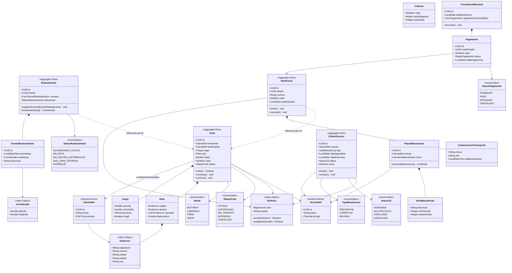

# Atividade: Domain-Driven Design Aplicado a uma Operadora Logística

## Cenário

Empresa de logística com necessidade de modernizar sistema que envolve quatro grandes áreas: **Gestão de Fretes**, **Rastreamento**, **Faturamento** e **Manutenção de Frota**.

---

## 1. Gestão da Complexidade

À medida que o sistema da operadora logística cresce, o número de regras de negócio, integrações e atores envolvidos aumenta exponencialmente: tabelas de preço por modal, regulamentações fiscais distintas por estado, integrações com rastreadores GPS, manutenção preventiva baseada em quilometragem, conciliação bancária, entre outros. Sem uma estratégia clara, esse crescimento gera o famoso "big ball of mud", onde qualquer alteração em uma área impacta outras de forma imprevisível. O **DDD ajuda a empresa a organizar esse ecossistema** ao propor a divisão do sistema em **subdomínios** alinhados ao negócio real e em **bounded contexts** com fronteiras explícitas, cada um com seu próprio modelo e sua própria linguagem ubíqua. Isso significa que a equipe de Faturamento pode usar o termo "Nota Fiscal" com um significado preciso dentro do seu contexto, sem precisar negociar esse significado com o time de Rastreamento, que talvez nem use esse conceito. Como consequência prática, a empresa ganha **modularidade** (times trabalham em paralelo sem pisar uns nos outros), **escalabilidade técnica** (cada contexto pode ser escalado, evoluído ou até reescrito de forma independente), **alinhamento com o negócio** (o código reflete a forma como os especialistas raciocinam) e **redução do custo de mudança**, já que regras de um contexto deixam de vazar acidentalmente para os outros.

---

## 2. Domínios e Subdomínios

O **domínio principal** é "Logística de Entregas de Produtos". Ele se desdobra em subdomínios classificados conforme sua importância estratégica:

### Core Domain (Domínio Principal)
São aqueles que diferenciam a empresa da concorrência. É onde o maior investimento de modelagem deve ocorrer.

- **Gestão de Fretes**: cálculo inteligente de rotas, precificação dinâmica e escolha do modal mais adequado (motoboy, navio, trem, caminhão). É o coração do negócio — se este subdomínio é ruim, a empresa perde para concorrentes.
- **Rastreamento em Tempo Real**: visibilidade da entrega para cliente e operação. Diferencial competitivo direto, pois clientes corporativos exigem rastreabilidade.

### Supporting Subdomains (Subdomínios de Suporte)
Essenciais para o negócio funcionar, mas não são o diferencial estratégico. Podem ser construídos internamente com menos investimento que o core.

- **Manutenção de Frota**: controle preventivo dos veículos. Sem ele, fretes falham, mas em si não é o que o cliente compra.

### Generic Subdomains (Subdomínios Genéricos)
Comuns a praticamente qualquer empresa. Idealmente devem ser **comprados/integrados** (ERP, gateway de pagamento) em vez de construídos do zero.

- **Faturamento**: emissão de notas fiscais (NF-e/CT-e) e conciliação bancária. Existe legislação rígida e padronizada; faz mais sentido integrar com soluções fiscais prontas do que reinventar.

| Subdomínio              | Classificação | Justificativa                                              |
|-------------------------|---------------|------------------------------------------------------------|
| Gestão de Fretes        | Core          | Diferencial competitivo direto                             |
| Rastreamento            | Core          | Exigência de clientes corporativos, valor percebido alto   |
| Manutenção de Frota     | Supporting    | Necessário, mas não diferencia                             |
| Faturamento             | Generic       | Padronizado por lei, mercado oferece soluções maduras      |

---

## 3. Bounded Contexts

Os bounded contexts definem **fronteiras semânticas** dentro do sistema. Dentro de cada contexto, um termo tem significado único. Foram identificados os seguintes contextos:

```
+-----------------------+      +-------------------------+
|  Contexto de Fretes   |<---->|  Contexto de            |
|  (Freight Management) |      |  Rastreamento (Tracking)|
+-----------------------+      +-------------------------+
          |                              |
          | (Customer-Supplier)          | (Published Events)
          v                              v
+-----------------------+      +-------------------------+
| Contexto de           |      | Contexto de Manutenção  |
| Faturamento (Billing) |      | (Fleet Maintenance)     |
+-----------------------+      +-------------------------+
                |                        ^
                | usa Cliente            | usa Veículo
                v                        |
            +-------------------------------+
            |   SHARED KERNEL               |
            |   (Cliente, Veículo,          |
            |   Endereço, Dinheiro)         |
            +-------------------------------+
```

**Descrição dos contextos:**

- **Contexto de Fretes**: responsável por cotação, contratação de frete, escolha de modal e roteirização. Dentro dele, "Frete" é uma entidade ativa com regras de cálculo.
- **Contexto de Rastreamento**: responsável pelo monitoramento físico da carga. Aqui "Frete" é apenas uma referência (ID) — o que importa são os eventos de localização. Consome eventos publicados pelo contexto de Fretes.
- **Contexto de Faturamento**: responsável por emissão fiscal e conciliação. Para ele, "Frete" se transforma em um "Item Faturável". Relação de **Customer-Supplier** com Fretes (Faturamento depende dos dados de Fretes).
- **Contexto de Manutenção de Frota**: responsável por planos preventivos e ordens de serviço. Aqui "Veículo" tem ciclo de vida próprio (entra/sai de manutenção). Comunica-se com Fretes via eventos (veículo indisponível).

**Relações entre contextos (mapas de contexto):**

| Origem        | Destino       | Padrão                  |
|---------------|---------------|-------------------------|
| Fretes        | Rastreamento  | Published Events        |
| Fretes        | Faturamento   | Customer-Supplier       |
| Manutenção    | Fretes        | Published Events (veículo indisponível) |
| Todos         | Shared Kernel | Shared Kernel           |

---

## 4. Linguagem Ubíqua (Glossário)

Termos que **devem ser usados de forma consistente** por toda a equipe (desenvolvedores, especialistas de negócio, comercial, operação):

| Termo                  | Definição                                                                                                       |
|------------------------|-----------------------------------------------------------------------------------------------------------------|
| **Frete**              | Contrato de serviço de transporte de uma carga, com origem, destino, modal e valor acordados.                  |
| **Modal**              | Tipo de transporte utilizado no frete (motoboy, caminhão, trem, navio). Cada modal possui regras de preço e tempo próprias. |
| **Carga**              | Conjunto de itens físicos (peso, volume, características) a serem transportados em um frete.                   |
| **Rota**               | Sequência de pontos (origem, paradas, destino) que define o caminho físico do transporte.                      |
| **Remessa (Shipment)** | Instância concreta de uma carga em movimento, vinculada a um veículo e a um motorista.                         |
| **Evento de Rastreamento** | Registro pontual da localização e situação de uma remessa em um instante de tempo.                          |
| **CT-e (Conhecimento de Transporte Eletrônico)** | Documento fiscal eletrônico que formaliza o frete perante a autoridade tributária.                |
| **Conciliação Bancária** | Processo de cruzar pagamentos recebidos via banco com as notas fiscais emitidas, garantindo consistência financeira. |
| **Ordem de Serviço (OS)** | Documento que autoriza e descreve uma manutenção a ser executada em um veículo da frota.                    |
| **Manutenção Preventiva** | Manutenção agendada conforme plano (por quilometragem ou tempo), antes da ocorrência de falha.              |
| **Frota**              | Conjunto de veículos da operadora disponíveis para execução de fretes.                                         |
| **Indisponibilidade de Veículo** | Estado do veículo que o impede de ser alocado para um frete (ex.: em manutenção, em viagem).         |

---

## 5. Design Estratégico — Shared Kernel

O **Shared Kernel** é um conjunto pequeno e estável de conceitos que múltiplos bounded contexts compartilham e cuja alteração exige acordo entre os times responsáveis. Para esta operadora logística, foram identificados como candidatos a shared kernel:

### Conceitos do Shared Kernel

- **Cliente (Customer)**: aparece em Fretes (como remetente/destinatário), em Faturamento (como emitente/destinatário da NF) e em Rastreamento (como consumidor da informação). Mantemos uma representação mínima compartilhada (ID, nome, documento, endereço).
- **Veículo**: aparece em Fretes (como meio de transporte alocado) e em Manutenção (como ativo cuidado). Representação mínima: ID, placa, tipo.
- **Endereço (Value Object)**: usado em rotas, cadastro de cliente, faturamento. É imutável e validado.
- **Dinheiro (Value Object)**: valor monetário com moeda. Usado em Fretes (preço), Faturamento (valor da NF) e Manutenção (custo da OS).

### Por que esses e não outros?

O cuidado fundamental é **não inchar** o shared kernel — quanto maior ele for, mais acoplados os contextos ficam. Por exemplo, "Frete" **não** entra no shared kernel mesmo aparecendo em vários contextos, porque cada contexto tem um significado próprio (em Faturamento é "item faturável", em Rastreamento é apenas uma referência). Cada contexto guarda sua **própria versão do Frete**, sincronizada via eventos ou IDs.

### Conexões via Eventos (não shared kernel)

Algumas conexões não exigem compartilhar modelo, apenas publicar eventos:

- `FreteContratado` → consumido por Rastreamento (inicia monitoramento) e Faturamento (gera CT-e).
- `EntregaConcluida` → consumido por Faturamento (libera cobrança final).
- `VeiculoEmManutencao` → consumido por Fretes (impede alocação).
- `PagamentoRecebido` → publicado por Faturamento, consumido por relatórios.

Isso reduz acoplamento e mantém autonomia entre os contextos.

---

## 6. Estrutura do Projeto Java Spring Boot

Estrutura proposta seguindo **Modular Monolith** organizado por bounded context, com camadas DDD (Domain, Application, Infrastructure, Interfaces) dentro de cada contexto. Essa estrutura permite, no futuro, extrair qualquer contexto para um microsserviço com baixo custo.

```
logistica-system/
│
├── pom.xml
├── README.md
│
└── src/
    ├── main/
    │   ├── java/
    │   │   └── com/empresa/logistica/
    │   │       │
    │   │       ├── LogisticaApplication.java          ← Bootstrap Spring Boot
    │   │       │
    │   │       ├── sharedkernel/                      ← Conceitos compartilhados
    │   │       │   ├── domain/
    │   │       │   │   ├── valueobject/
    │   │       │   │   │   ├── Endereco.java
    │   │       │   │   │   ├── Dinheiro.java
    │   │       │   │   │   ├── CNPJ.java
    │   │       │   │   │   └── Coordenada.java
    │   │       │   │   └── model/
    │   │       │   │       ├── ClienteRef.java        ← Representação mínima
    │   │       │   │       └── VeiculoRef.java        ← Representação mínima
    │   │       │   └── events/
    │   │       │       ├── DomainEvent.java           ← Interface base
    │   │       │       └── EventPublisher.java
    │   │       │
    │   │       ├── frete/                             ← BOUNDED CONTEXT: Fretes
    │   │       │   ├── domain/
    │   │       │   │   ├── model/
    │   │       │   │   │   ├── Frete.java             ← Aggregate Root
    │   │       │   │   │   ├── Carga.java
    │   │       │   │   │   ├── Rota.java
    │   │       │   │   │   ├── Modal.java             ← Enum
    │   │       │   │   │   ├── StatusFrete.java
    │   │       │   │   │   └── Cotacao.java
    │   │       │   │   ├── repository/
    │   │       │   │   │   └── FreteRepository.java   ← Interface
    │   │       │   │   ├── service/
    │   │       │   │   │   ├── CalculadoraFreteService.java
    │   │       │   │   │   ├── RoteirizadorService.java
    │   │       │   │   │   └── EscolhaModalService.java
    │   │       │   │   └── events/
    │   │       │   │       ├── FreteContratadoEvent.java
    │   │       │   │       └── EntregaConcluidaEvent.java
    │   │       │   │
    │   │       │   ├── application/
    │   │       │   │   ├── dto/
    │   │       │   │   │   ├── CotacaoRequest.java
    │   │       │   │   │   ├── CotacaoResponse.java
    │   │       │   │   │   └── FreteDTO.java
    │   │       │   │   └── usecase/
    │   │       │   │       ├── CotarFreteUseCase.java
    │   │       │   │       ├── ContratarFreteUseCase.java
    │   │       │   │       └── ConcluirEntregaUseCase.java
    │   │       │   │
    │   │       │   ├── infrastructure/
    │   │       │   │   ├── persistence/
    │   │       │   │   │   ├── FreteJpaEntity.java
    │   │       │   │   │   ├── FreteJpaRepository.java
    │   │       │   │   │   └── FreteRepositoryImpl.java
    │   │       │   │   └── external/
    │   │       │   │       └── MapsRoteirizadorAdapter.java
    │   │       │   │
    │   │       │   └── interfaces/
    │   │       │       └── rest/
    │   │       │           └── FreteController.java
    │   │       │
    │   │       ├── rastreamento/                      ← BOUNDED CONTEXT: Rastreamento
    │   │       │   ├── domain/
    │   │       │   │   ├── model/
    │   │       │   │   │   ├── Rastreamento.java      ← Aggregate Root
    │   │       │   │   │   ├── EventoRastreamento.java
    │   │       │   │   │   └── StatusRastreamento.java
    │   │       │   │   ├── repository/
    │   │       │   │   │   └── RastreamentoRepository.java
    │   │       │   │   └── service/
    │   │       │   │       └── MonitoramentoService.java
    │   │       │   ├── application/
    │   │       │   │   ├── dto/
    │   │       │   │   └── usecase/
    │   │       │   │       ├── IniciarRastreamentoUseCase.java
    │   │       │   │       ├── RegistrarEventoUseCase.java
    │   │       │   │       └── ConsultarStatusUseCase.java
    │   │       │   ├── infrastructure/
    │   │       │   │   ├── persistence/
    │   │       │   │   ├── messaging/
    │   │       │   │   │   └── FreteContratadoListener.java   ← Consome evento
    │   │       │   │   └── external/
    │   │       │   │       └── GpsProviderAdapter.java
    │   │       │   └── interfaces/
    │   │       │       └── rest/
    │   │       │           └── RastreamentoController.java
    │   │       │
    │   │       ├── faturamento/                       ← BOUNDED CONTEXT: Faturamento
    │   │       │   ├── domain/
    │   │       │   │   ├── model/
    │   │       │   │   │   ├── NotaFiscal.java        ← Aggregate Root
    │   │       │   │   │   ├── ConhecimentoTransporte.java  ← CT-e
    │   │       │   │   │   ├── Pagamento.java
    │   │       │   │   │   ├── StatusPagamento.java
    │   │       │   │   │   └── ConciliacaoBancaria.java
    │   │       │   │   ├── repository/
    │   │       │   │   │   ├── NotaFiscalRepository.java
    │   │       │   │   │   └── PagamentoRepository.java
    │   │       │   │   └── service/
    │   │       │   │       ├── EmissorNotaFiscalService.java
    │   │       │   │       └── ConciliacaoService.java
    │   │       │   ├── application/
    │   │       │   │   ├── dto/
    │   │       │   │   └── usecase/
    │   │       │   │       ├── EmitirNotaFiscalUseCase.java
    │   │       │   │       └── ConciliarPagamentosUseCase.java
    │   │       │   ├── infrastructure/
    │   │       │   │   ├── persistence/
    │   │       │   │   ├── messaging/
    │   │       │   │   │   └── EntregaConcluidaListener.java
    │   │       │   │   └── external/
    │   │       │   │       ├── SefazAdapter.java
    │   │       │   │       └── BancoAdapter.java
    │   │       │   └── interfaces/
    │   │       │       └── rest/
    │   │       │           └── FaturamentoController.java
    │   │       │
    │   │       └── manutencao/                        ← BOUNDED CONTEXT: Manutenção
    │   │           ├── domain/
    │   │           │   ├── model/
    │   │           │   │   ├── OrdemServico.java      ← Aggregate Root
    │   │           │   │   ├── PlanoManutencao.java
    │   │           │   │   ├── ItemManutencao.java
    │   │           │   │   ├── TipoManutencao.java
    │   │           │   │   └── StatusOS.java
    │   │           │   ├── repository/
    │   │           │   │   └── OrdemServicoRepository.java
    │   │           │   ├── service/
    │   │           │   │   └── AgendadorManutencaoService.java
    │   │           │   └── events/
    │   │           │       └── VeiculoEmManutencaoEvent.java
    │   │           ├── application/
    │   │           │   ├── dto/
    │   │           │   └── usecase/
    │   │           │       ├── AgendarManutencaoUseCase.java
    │   │           │       └── ConcluirOSUseCase.java
    │   │           ├── infrastructure/
    │   │           │   ├── persistence/
    │   │           │   └── messaging/
    │   │           └── interfaces/
    │   │               └── rest/
    │   │                   └── ManutencaoController.java
    │   │
    │   └── resources/
    │       ├── application.yml
    │       └── db/migration/                          ← Flyway / Liquibase
    │
    └── test/
        └── java/
            └── com/empresa/logistica/
                ├── frete/
                ├── rastreamento/
                ├── faturamento/
                └── manutencao/
```

### Por que essa estrutura?

- **Cada bounded context é um pacote raiz** (`frete`, `rastreamento`, `faturamento`, `manutencao`). Visualmente fica óbvio quais são as fronteiras do sistema.
- **Camadas internas por contexto** (`domain`, `application`, `infrastructure`, `interfaces`) seguem **Clean Architecture / Hexagonal**. As dependências apontam para dentro: `interfaces` → `application` → `domain`; `infrastructure` → `domain` (por inversão de dependência, implementando interfaces do domínio).
- **`domain` não conhece Spring**: é Java puro, com regras de negócio. Isso permite testes rápidos e independência de framework.
- **`infrastructure` contém os detalhes técnicos**: JPA, mensageria, adaptadores HTTP para serviços externos (SEFAZ, GPS, mapas).
- **`interfaces/rest` expõe a API HTTP**, atuando como tradutor entre o mundo externo e a aplicação.
- **`sharedkernel` é deliberadamente enxuto** — apenas Value Objects e referências mínimas. Tudo o que for específico de um contexto fica dentro dele.
- **Comunicação entre contextos é via eventos** (pacote `messaging`), nunca via chamada direta a classes de outro contexto. Isso preserva as fronteiras.

---

## 7. Diagrama de Classes (Mermaid)



### Notas sobre o diagrama

- Os estereótipos `<<Aggregate Root>>` indicam as entidades que são os pontos de entrada de cada contexto — são as únicas que podem ser obtidas via repositório.
- `<<Value Object>>` indica objetos imutáveis identificados pelo valor (Endereco, Dinheiro, Coordenada).
- `<<Shared Kernel>>` indica os modelos pertencentes ao Shared Kernel.
- A linha tracejada (`..>`) representa **referência por ID**, não associação direta. Por exemplo, `Rastreamento` conhece apenas o `freteId`, não a entidade `Frete`. Isso preserva a fronteira entre contextos.
- A linha sólida com losango (`*--`) representa **composição** (parte-todo, mesmo ciclo de vida).
- A seta simples (`-->`) representa **associação** comum.

---

## 8. Explicação Detalhada e Justificativas Arquiteturais

### Por que organizar por bounded context e não por camadas técnicas?

Uma estrutura clássica em Spring tende a ser organizada por camada técnica: `controller/`, `service/`, `repository/`, `model/`. Embora intuitiva, **essa organização espalha cada feature por várias pastas**, dificultando a evolução. Ao mexer em "Faturamento", o desenvolvedor toca em 4 lugares diferentes. Organizar **por bounded context** mantém tudo de cada contexto junto, alinhado ao princípio de alta coesão e baixo acoplamento — o ponto central de DDD.

### Por que monolito modular em vez de microsserviços diretos?

Microsserviços trazem complexidade operacional alta (rede, observabilidade distribuída, transações distribuídas, etc.). Para uma empresa que está modernizando seu sistema, é mais seguro começar com **monolito modular bem desenhado** — onde cada bounded context já está isolado no nível de pacote, com comunicação interna via eventos. Quando um contexto precisar escalar ou for muito alterado, ele pode ser **extraído para um microsserviço** com baixo custo, pois as fronteiras já estão respeitadas. Esta é a estratégia recomendada por DDD: **"Modular First, Microservices Later"**.

### Por que separar `domain`, `application`, `infrastructure` e `interfaces`?

Essa divisão segue Arquitetura Hexagonal (Ports & Adapters), que é o casamento natural de DDD com arquitetura limpa:

- **`domain`** contém a essência do negócio: entidades, value objects, regras, eventos. **Não depende de nada externo** (nem do Spring). Em Frete, por exemplo, `Frete.cotar()` aplica regras de cálculo sem saber se isso será exposto via REST ou GraphQL, ou se vai persistir em PostgreSQL ou MongoDB. Isso torna o domínio testável e durável.
- **`application`** orquestra casos de uso. `CotarFreteUseCase` recebe uma requisição, chama o domínio, e retorna uma resposta. É a "regra de orquestração", não a "regra de negócio".
- **`infrastructure`** implementa os detalhes técnicos: como persistir (JPA), como enviar mensagens (Kafka, RabbitMQ), como falar com APIs externas (SEFAZ, Google Maps).
- **`interfaces`** é o ponto de contato com o mundo (controllers REST, listeners de mensagem, scheduled jobs).

A regra de ouro: **as dependências apontam para o domínio, nunca o contrário**. O domínio define interfaces (`FreteRepository`), e a infrastructure as implementa.

### Por que eventos entre contextos?

Se `Faturamento` chamasse `Fretes` diretamente (`freteService.buscarFrete(id)`), criaríamos acoplamento forte: mudanças em Fretes quebram Faturamento, e os dois contextos não conseguem evoluir em ritmos próprios. Com **eventos de domínio** (`FreteContratadoEvent`, `EntregaConcluidaEvent`), Fretes apenas publica o que aconteceu, e quem se interessar consome. Isso permite que Faturamento processe o evento de forma assíncrona, com retry, sem travar a operação principal.

### Por que Shared Kernel é mínimo?

A tentação é colocar tudo que parece "comum" no Shared Kernel — Cliente, Produto, Frete, etc. **Esse é o caminho mais rápido para um monolito acoplado.** Quanto maior o shared kernel, mais times precisam concordar para qualquer mudança. Por isso ele contém apenas o que é verdadeiramente universal e estável: Value Objects básicos (`Endereco`, `Dinheiro`, `CNPJ`) e referências mínimas (`ClienteRef`, `VeiculoRef` com poucos campos imutáveis). Cada contexto pode ter seu próprio "Cliente" enriquecido conforme sua necessidade — Faturamento talvez precise de regime tributário, Rastreamento talvez precise de preferências de notificação, e tudo bem que sejam modelos diferentes.

### Por que Aggregate Roots?

Em cada contexto, há uma ou mais **Aggregate Roots** — a entidade que coordena um conjunto consistente de objetos e é a única que pode ser obtida via repositório. Em Fretes, `Frete` é o agregado raiz que contém `Carga` e `Rota`. Não existe `CargaRepository` — `Carga` só existe dentro de um `Frete`. Isso garante **consistência transacional**: sempre que se salva, o agregado inteiro é salvo de forma coesa, e invariantes do negócio são respeitadas.

### Resumo: o que essa arquitetura entrega para o negócio

1. **Velocidade de evolução**: times podem trabalhar em contextos diferentes sem se atropelar.
2. **Resiliência**: falha em um contexto não derruba os outros, especialmente com comunicação assíncrona.
3. **Alinhamento ao negócio**: a estrutura do código reflete a estrutura da empresa, facilitando conversa com especialistas de domínio.
4. **Caminho evolutivo claro**: do monolito modular ao microsserviço, sem reescrita.
5. **Testabilidade**: domínio puro é testado em milissegundos, sem subir Spring nem banco.

---

## Considerações Finais

Este desenho aplica o **DDD Estratégico** (subdomínios, bounded contexts, linguagem ubíqua, mapas de contexto, shared kernel) e prepara o terreno para o **DDD Tático** (Aggregates, Entities, Value Objects, Repositories, Domain Events, Services). A arquitetura proposta é defensável tanto do ponto de vista de DDD quanto de Clean Architecture, e está alinhada com práticas modernas de desenho de sistemas corporativos.