# Documentação da Arquitetura — API de Biblioteca em Spring Boot

```mermaid
classDiagram
direction TB

%% =================================================
%% REQUESTS / RESPONSES
%% =================================================

namespace Requests {

    class BookCreateRequest {
        -String title
        -String category
        -String isbn
        -String author
        -Integer pages
    }

    class BookUpdateRequest {
        -String title
        -String category
        -String isbn
        -String author
        -Integer pages
    }

    class DVDCreateRequest {
        -String title
        -String category
        -String director
        -Integer durationMinutes
        -String ageRating
    }

    class DVDUpdateRequest {
        -String title
        -String category
        -String director
        -Integer durationMinutes
        -String ageRating
    }

    class LoanCreateRequest {
        -Long userId
        -Long itemId
    }

    class LoanUpdateRequest {
        -LoanStatus status
        -LocalDate returnDate
    }

    class UserCreateRequest {
        -String name
        -String email
        -String password
        -String phone
    }

    class UserUpdateRequest {
        -String name
        -String phone
    }
}

namespace Responses {

    class BookResponse {
        -Long id
        -String title
        -String category
        -String isbn
        -String author
        -Integer pages
        -Boolean available
    }

    class DVDResponse {
        -Long id
        -String title
        -String category
        -String director
        -Integer durationMinutes
        -String ageRating
        -Boolean available
    }

    class LoanResponse {
        -Long id
        -Long userId
        -Long itemId
        -LocalDate loanDate
        -LocalDate returnDate
        -LoanStatus status
    }

    class UserResponse {
        -Long id
        -String name
        -String email
        -String phone
    }
}

%% =================================================
%% CONTROLLERS
%% =================================================

namespace Controllers {

class LoanController {
    -LoanFacade loanFacade
    +create(LoanCreateRequest req) ResponseEntity~LoanResponse~
    +update(Long id, LoanUpdateRequest req) ResponseEntity~LoanResponse~
    +delete(Long id) ResponseEntity~Void~
    +list() ResponseEntity~List~LoanResponse~~
}

class BookController {
    -BookService bookService
    +create(BookCreateRequest req) ResponseEntity~BookResponse~
    +update(Long id, BookUpdateRequest req) ResponseEntity~BookResponse~
    +delete(Long id) ResponseEntity~Void~
    +list() ResponseEntity~List~BookResponse~~
}

class DVDController {
    -DVDService dvdService
    +create(DVDCreateRequest req) ResponseEntity~DVDResponse~
    +update(Long id, DVDUpdateRequest req) ResponseEntity~DVDResponse~
    +delete(Long id) ResponseEntity~Void~
    +list() ResponseEntity~List~DVDResponse~~
}

class UserController {
    -UserService userService
    +create(UserCreateRequest req) ResponseEntity~UserResponse~
    +update(Long id, UserUpdateRequest req) ResponseEntity~UserResponse~
    +delete(Long id) ResponseEntity~Void~
    +list() ResponseEntity~List~UserResponse~~
}
}

%% =================================================
%% FACADE
%% =================================================

namespace Facade {

class LoanFacade {
    -BookService bookService
    -DVDService dvdService
    -UserService userService
    -LoanService loanService
    +createLoan(LoanCreateRequest req) LoanResponse
}
}

%% =================================================
%% SERVICES
%% =================================================

namespace Services {

class LoanService {
    -LoanRepository loanRepository
    -List~Notification~ notificationList
    +create(LoanCreateRequest req) LoanResponse
    +update(Long id, LoanUpdateRequest req) LoanResponse
    +delete(Long id) void
    +list() List~LoanResponse~
}

class BookService {
    -BookRepository bookRepository
    +create(BookCreateRequest req) BookResponse
    +update(Long id, BookUpdateRequest req) BookResponse
    +delete(Long id) void
    +list() List~BookResponse~
}

class DVDService {
    -DVDRepository dvdRepository
    +create(DVDCreateRequest req) DVDResponse
    +update(Long id, DVDUpdateRequest req) DVDResponse
    +delete(Long id) void
    +list() List~DVDResponse~
}

class UserService {
    -UserRepository userRepository
    +create(UserCreateRequest req) UserResponse
    +update(Long id, UserUpdateRequest req) UserResponse
    +delete(Long id) void
    +list() List~UserResponse~
}
}

%% =================================================
%% MAPPERS
%% =================================================

namespace Mappers {

class LoanMapper {
    <<interface>>
    +toEntity(LoanCreateRequest req) Loan
    +toResponse(Loan loan) LoanResponse
    +updateEntity(Loan loan, LoanUpdateRequest req) void
}

class BookMapper {
    <<interface>>
    +toEntity(BookCreateRequest req) Book
    +toResponse(Book book) BookResponse
    +updateEntity(Book book, BookUpdateRequest req) void
}

class DVDMapper {
    <<interface>>
    +toEntity(DVDCreateRequest req) DVD
    +toResponse(DVD dvd) DVDResponse
    +updateEntity(DVD dvd, DVDUpdateRequest req) void
}

class UserMapper {
    <<interface>>
    +toEntity(UserCreateRequest req) User
    +toResponse(User user) UserResponse
    +updateEntity(User user, UserUpdateRequest req) void
}
}

%% =================================================
%% REPOSITORIES
%% =================================================

namespace Repositories {

class JpaRepository {
    <<interface>>
}

class LoanRepository {
    <<interface>>
}

class BookRepository {
    <<interface>>
}

class DVDRepository {
    <<interface>>
}

class UserRepository {
    <<interface>>
}
}

%% =================================================
%% DOMAIN
%% =================================================

namespace Domain {

class LibraryItem {
    <<abstract>>
    #Long id
    #String title
    #String category
    #Boolean available
}

class Book {
    -String isbn
    -String author
    -Integer pages
}

class DVD {
    -String director
    -Integer durationMinutes
    -String ageRating
}

class Loan {
    -Long id
    -LocalDate loanDate
    -LocalDate returnDate
    -LoanStatus status
}

class User {
    -Long id
    -String name
    -String email
    -String password
    -String phone
}
}

%% =================================================
%% FACTORY
%% =================================================

namespace Factory {

class LibraryItemFactory {
    -BookMapper bookMapper
    -DVDMapper dvdMapper
    +createBook(BookCreateRequest req) Book
    +createDVD(DVDCreateRequest req) DVD
}
}

%% =================================================
%% OBSERVER
%% =================================================

namespace Observer {

class Notification {
    <<interface>>
    +send(Loan loan) void
}

class EmailNotification
class SMSNotification
class WhatsAppNotification
}

%% =================================================
%% SEARCH STRATEGY
%% =================================================

namespace Strategy {

class LibraryItemSearch {
    <<interface>>
    +getType() String
    +search(String value) List~LibraryItem~
}

class TitleSearch
class CategorySearch
class IdentifierSearch
class AuthorSearch
}

%% =================================================
%% INHERITANCE
%% =================================================

JpaRepository <|-- LoanRepository : herda operações JPA
JpaRepository <|-- BookRepository : herda operações JPA
JpaRepository <|-- DVDRepository : herda operações JPA
JpaRepository <|-- UserRepository : herda operações JPA

LibraryItem <|-- Book : Book herda atributos do item
LibraryItem <|-- DVD : DVD herda atributos do item

Notification <|.. EmailNotification : implementa envio por email
Notification <|.. SMSNotification : implementa envio por SMS
Notification <|.. WhatsAppNotification : implementa envio por WhatsApp

LibraryItemSearch <|.. TitleSearch : busca por título
LibraryItemSearch <|.. CategorySearch : busca por categoria
LibraryItemSearch <|.. IdentifierSearch : busca por identificador
LibraryItemSearch <|.. AuthorSearch : busca por autor

%% =================================================
%% DOMAIN RELATIONSHIPS
%% =================================================

User "1" --> "0..*" Loan : usuário pode possuir vários empréstimos
LibraryItem "1" --> "0..*" Loan : item pode ser emprestado várias vezes

%% =================================================
%% CONTROLLER RELATIONSHIPS
%% =================================================

LoanController ..> LoanFacade : controller envia requisição de empréstimo para facade

BookController ..> BookService : controller delega regras de negócio de livros
DVDController ..> DVDService : controller delega regras de negócio de DVDs
UserController ..> UserService : controller delega regras de negócio de usuários

%% =================================================
%% FACADE RELATIONSHIPS
%% =================================================

LoanFacade ..> LoanService : facade cria e gerencia empréstimos
LoanFacade ..> BookService : facade valida disponibilidade do livro
LoanFacade ..> DVDService : facade valida disponibilidade do DVD
LoanFacade ..> UserService : facade valida usuário antes do empréstimo

%% =================================================
%% SERVICE RELATIONSHIPS
%% =================================================

LoanService ..> LoanRepository : service persiste empréstimos no banco
BookService ..> BookRepository : service persiste livros no banco
DVDService ..> DVDRepository : service persiste DVDs no banco
UserService ..> UserRepository : service persiste usuários no banco

%% =================================================
%% MAPPER RELATIONSHIPS
%% =================================================

LoanService ..> LoanMapper : converte DTO em entidade e entidade em response
BookService ..> BookMapper : converte DTO em entidade e entidade em response
DVDService ..> DVDMapper : converte DTO em entidade e entidade em response
UserService ..> UserMapper : converte DTO em entidade e entidade em response

%% =================================================
%% FACTORY RELATIONSHIPS
%% =================================================

BookService ..> LibraryItemFactory : service utiliza factory para criar Book
DVDService ..> LibraryItemFactory : service utiliza factory para criar DVD

LibraryItemFactory ..> BookMapper : factory usa mapper para converter Book
LibraryItemFactory ..> DVDMapper : factory usa mapper para converter DVD

%% =================================================
%% OBSERVER RELATIONSHIPS
%% =================================================

LoanService ..> Notification : service dispara notificações após empréstimo

%% =================================================
%% DTO RELATIONSHIPS
%% =================================================

BookController ..> BookCreateRequest : recebe dados para criação de livro
BookController ..> BookUpdateRequest : recebe dados para atualização de livro
BookController ..> BookResponse : retorna resposta de livro

DVDController ..> DVDCreateRequest : recebe dados para criação de DVD
DVDController ..> DVDUpdateRequest : recebe dados para atualização de DVD
DVDController ..> DVDResponse : retorna resposta de DVD

LoanController ..> LoanCreateRequest : recebe dados para criação de empréstimo
LoanController ..> LoanUpdateRequest : recebe dados para atualização de empréstimo
LoanController ..> LoanResponse : retorna resposta de empréstimo

UserController ..> UserCreateRequest : recebe dados para criação de usuário
UserController ..> UserUpdateRequest : recebe dados para atualização de usuário
UserController ..> UserResponse : retorna resposta de usuário
```



## Visão Geral

Transformei o diagrama de classes da atividade em uma API REST completa utilizando Spring Boot, buscando respeitar os princípios SOLID e aplicar padrões de projeto de forma consciente e justificada. A seguir, explico cada decisão arquitetural que tomei.

---

## Princípios SOLID Aplicados

### S — Single Responsibility Principle (Princípio da Responsabilidade Única)

Apliquei o SRP em todas as camadas da aplicação. Cada classe tem uma única razão para mudar:

- **Controllers** são responsáveis exclusivamente por receber requisições HTTP, validar a entrada e devolver uma resposta. Nenhuma regra de negócio vive nelas.
- **Services** concentram toda a lógica de negócio de sua respectiva entidade. `BookService` cuida apenas das regras de um livro; `DVDService`, apenas das regras de um DVD — e assim por diante. Isso evita que regras de entidades distintas colidam dentro de um mesmo serviço.
- **Repositories** têm a única responsabilidade de se comunicar com o banco de dados.
- **Mappers** existem apenas para converter dados entre camadas (DTO → Entidade e Entidade → Response).

### O — Open/Closed Principle (Princípio do Aberto/Fechado)

Esse princípio diz que uma classe deve estar aberta para extensão, mas fechada para modificação. Garanti isso em dois lugares principais:

- **Observer (Notification):** Para adicionar um novo canal de notificação — como, por exemplo, uma notificação push —, basta criar uma nova classe que implemente a interface `Notification` e registrá-la na lista de observadores do `LoanService`. Não preciso mexer em nenhuma classe existente.
- **Strategy (LibraryItemSearch):** Para adicionar um novo tipo de busca, basta criar uma nova classe que implemente `LibraryItemSearch`. O ponto de entrada da busca na service não precisa ser alterado.

### I — Interface Segregation Principle (Princípio da Segregação de Interfaces)

Os exemplos mais intencionais do ISP na minha aplicação são o `LibraryItemSearch` e o `Notification`. A interface `LibraryItemSearch` define apenas `getType()` e `search()` — o contrato mínimo para uma estratégia de busca. A interface `Notification` define apenas `send()`. Em nenhum dos dois casos uma implementação é obrigada a depender de métodos que não usa. Essas foram decisões puramente de design.

No caso dos Mappers, a motivação técnica para serem interfaces veio do **MapStruct**. O MapStruct é uma biblioteca de mapeamento que, em tempo de compilação, lê a interface anotada com `@Mapper(componentModel = "spring")` e gera automaticamente a implementação concreta, registrando-a como Bean do Spring. Ou seja, eu nunca escrevo a implementação — defino apenas o contrato, e o MapStruct cuida do resto.

Vale destacar também o método `updateEntity()` com `@MappingTarget`: ele atualiza uma entidade já existente ignorando os campos nulos da request, que é exatamente o comportamento correto para um `PATCH` — apenas os campos enviados são alterados, sem sobrescrever o restante.

Dito isso, a decisão de manter os mappers segregados por entidade — `BookMapper`, `DVDMapper`, `LoanMapper` e `UserMapper` — em vez de criar uma única interface `LibraryMapper` com todos os métodos juntos foi uma escolha arquitetural consciente que respeita o ISP. Se existisse um mapper único, o `BookService`, por exemplo, seria obrigado a depender de uma interface com métodos de `Loan`, `DVD` e `User` que ele nunca usa. Ao segregar, cada service depende apenas do contrato mínimo que realmente precisa. A motivação foi técnica (MapStruct); a forma como apliquei foi guiada pelo ISP.

---

## Padrões de Projeto

### Facade — `LoanFacade`

Criar um empréstimo é uma operação que envolve múltiplos contextos: preciso verificar se o usuário existe, se o item está disponível e então persistir o empréstimo (exemplos). Delegar essa orquestração para a `LoanController` violaria o SRP, e distribuí-la entre os services geraria acoplamento desnecessário entre eles.

Por isso, criei a `LoanFacade`. Ela é o único ponto que conhece e coordena `BookService`, `DVDService`, `UserService` e `LoanService` para realizar a criação de um empréstimo. A controller simplesmente chama `loanFacade.createLoan()` e não precisa saber de nada mais. Isso simplifica e centraliza a lógica de orquestração em um único lugar, que é exatamente o propósito do padrão Facade.

### Simple Factory — `LibraryItemFactory`

`Book` e `DVD` são subtipos de `LibraryItem`, mas possuem atributos diferentes e processos de criação distintos. Instanciar esses objetos diretamente dentro das services adicionaria a elas uma responsabilidade que não é delas — a de saber como montar um objeto complexo.

Resolvi isso criando a `LibraryItemFactory`, uma Simple Factory com os métodos `createBook()` e `createDVD()`. Quando o `BookService` precisa de um novo livro, ele delega essa criação para a factory, que internamente utiliza o `BookMapper` para converter os dados da request na entidade correta. O mesmo vale para o DVD. Dessa forma, a lógica de instanciação fica isolada e qualquer mudança na forma de criar um `LibraryItem` impacta apenas a factory.

### Observer — `Notification`

O `LoanService` precisa disparar notificações para os usuários quando algo relevante acontece em um empréstimo — como uma mudança de status. Em vez de chamar diretamente `EmailNotification`, `SMSNotification` ou `WhatsAppNotification` dentro do service, utilizei o padrão Observer.

O `LoanService` mantém uma lista de `Notification` (a lista de observadores, representada pelo atributo `notificationList`). Quando o evento ocorre, ele itera sobre essa lista e chama `send()` em cada observador registrado. Isso garante que adicionar um novo canal de notificação (como WhatsApp) não exige nenhuma mudança no `LoanService` — basta registrar a nova implementação na lista. O service é o sujeito (Subject), e cada implementação de `Notification` é um observador (Observer).

### Strategy — `LibraryItemSearch`

Um sistema de biblioteca naturalmente possui múltiplos tipos de busca: por título, por categoria, por identificador, por autor. Colocar toda essa lógica dentro de uma única service geraria um método gigante com vários `if/else` ou `switch`, o que é difícil de manter e estender.

Resolvi isso com o padrão Strategy. Criei a interface `LibraryItemSearch` com dois métodos: `getType()`, que identifica qual tipo de busca aquela estratégia representa, e `search()`, que executa a busca em si. Cada implementação — `TitleSearch`, `CategorySearch`, `IdentifierSearch` e `AuthorSearch` — encapsula sua própria lógica. A rota `/search` recebe o tipo e o valor da pesquisa, a service seleciona a estratégia correta pelo `getType()` e delega a execução. Adicionar um novo tipo de busca é questão de criar uma nova classe — sem tocar em nenhuma existente.

### Singleton — Injeção de Dependência do Spring

No ecossistema do Spring, todos os Beans gerenciados pelo container (services, repositories, controllers, facades etc.) são instâncias únicas por padrão — ou seja, o próprio Spring garante o padrão Singleton para eles. Isso significa que em toda a aplicação existe apenas uma instância de `BookService`, uma de `LoanFacade`, uma de `UserRepository` e assim por diante. Não precisei implementar o padrão manualmente; ao utilizar as anotações `@Service`, `@Repository`, `@Component` e injeção via `@Autowired` ou construtor, o Spring cuida disso automaticamente. Essa é uma característica arquitetural do framework que aproveito conscientemente.

---

## Camadas e Responsabilidades

| Camada | Responsabilidade |
|---|---|
| **Controller** | Receber e validar requisições HTTP; devolver respostas |
| **Facade** | Orquestrar múltiplos services em operações complexas (ex.: criação de empréstimo) |
| **Service** | Conter as regras de negócio de cada entidade |
| **Factory** | Encapsular a lógica de criação de objetos `LibraryItem` |
| **Mapper** | Converter entre Request DTO, Entidade e Response DTO |
| **Repository** | Persistência e acesso ao banco de dados via JPA |
| **Observer** | Disparar notificações de forma desacoplada após eventos de empréstimo |
| **Strategy** | Encapsular diferentes algoritmos de busca de forma intercambiável |

---

## Fluxo de Criação de um Empréstimo

```
LoanController
    └── LoanFacade.createLoan()
            ├── UserService     → valida se o usuário existe
            ├── BookService     → valida disponibilidade do livro (se for livro)
            │       └── LibraryItemFactory.createBook() → BookMapper
            ├── DVDService      → valida disponibilidade do DVD (se for DVD)
            │       └── LibraryItemFactory.createDVD() → DVDMapper
            └── LoanService.create()
                    ├── LoanRepository  → persiste o empréstimo
                    ├── LoanMapper      → converte entidade em Response
                    └── Notification[]  → dispara notificações (Email, SMS, WhatsApp)
```

---

## Hierarquia de Domínio

`Book` e `DVD` herdam de `LibraryItem`, que é uma classe abstrata com os atributos comuns a qualquer item da biblioteca. Isso evita duplicação e permite que o `LibraryItemFactory` trate a criação de itens de forma polimórfica. `Loan` associa um `User` a um `LibraryItem`, representando o registro de empréstimo no sistema.

---

## Considerações Finais

A principal diretriz que segui ao construir essa API foi garantir que cada componente tivesse um motivo claro para existir e que mudanças futuras no sistema impactassem o menor número possível de classes. Os padrões de projeto foram aplicados por obrigação, boa parte desse sistema de livraria por exemplo penso é Over-engineering ter todos estes padrões, mas como meio de estudo, tentei implementar eles em lugares que eu via a possibilidade para tal.
